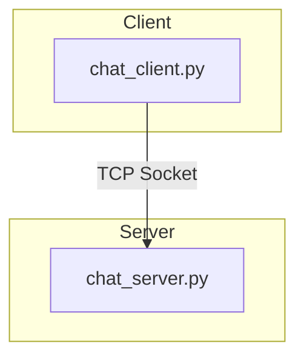
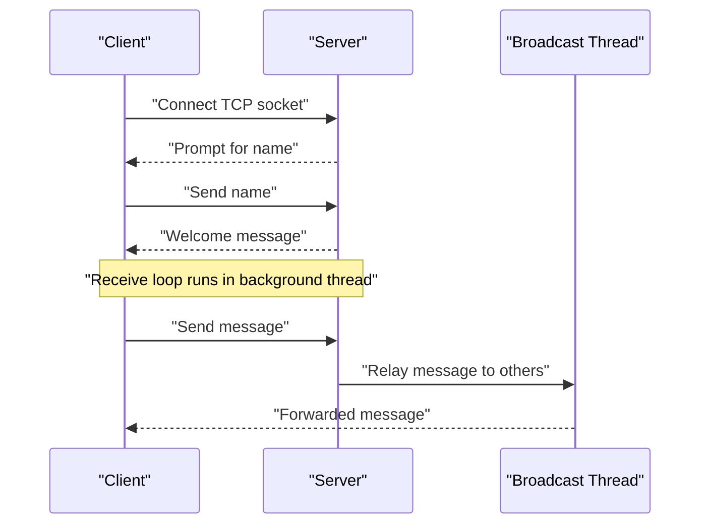
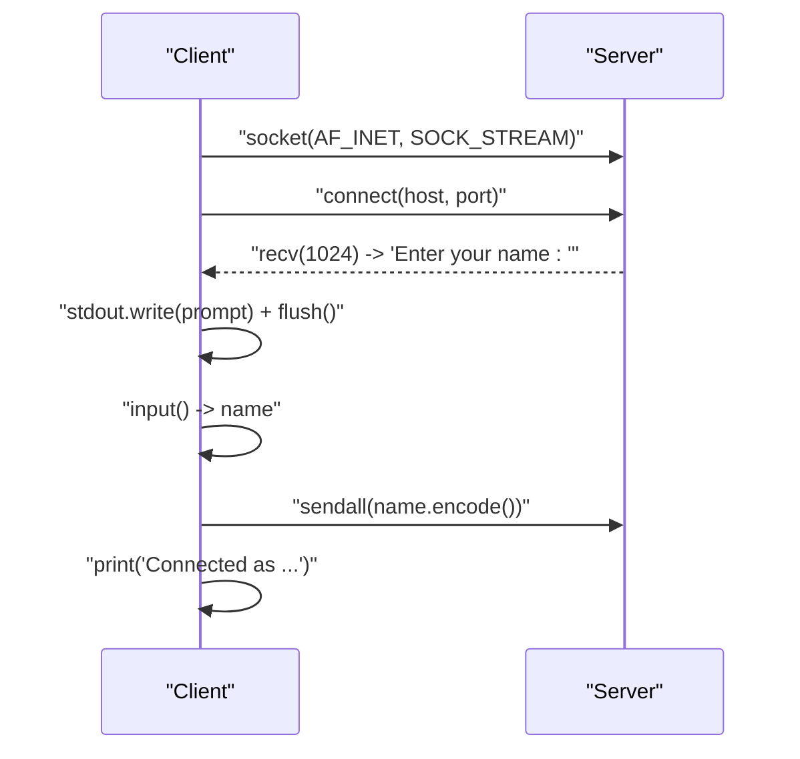
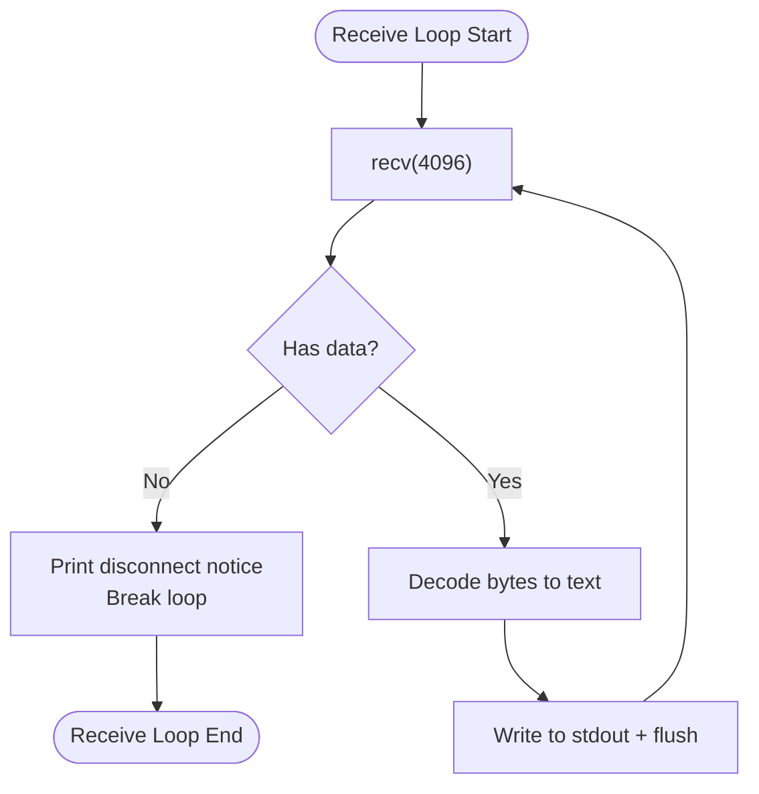
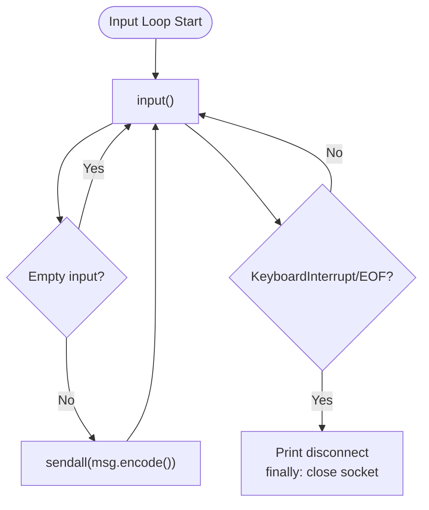
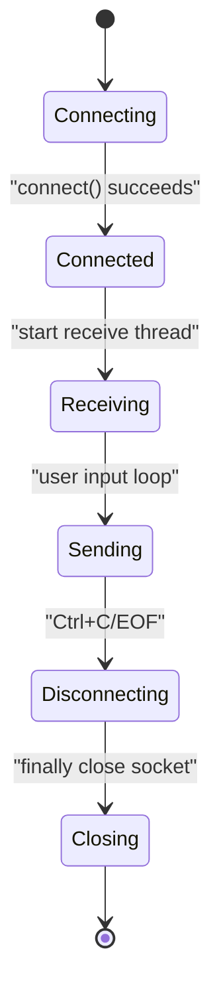
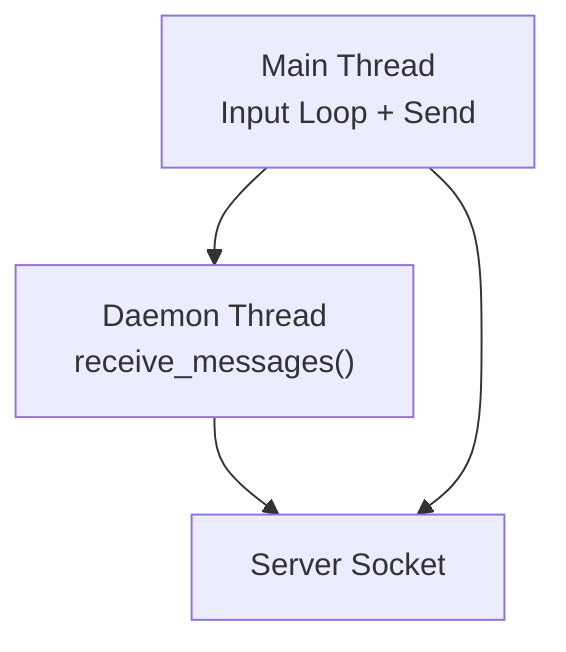
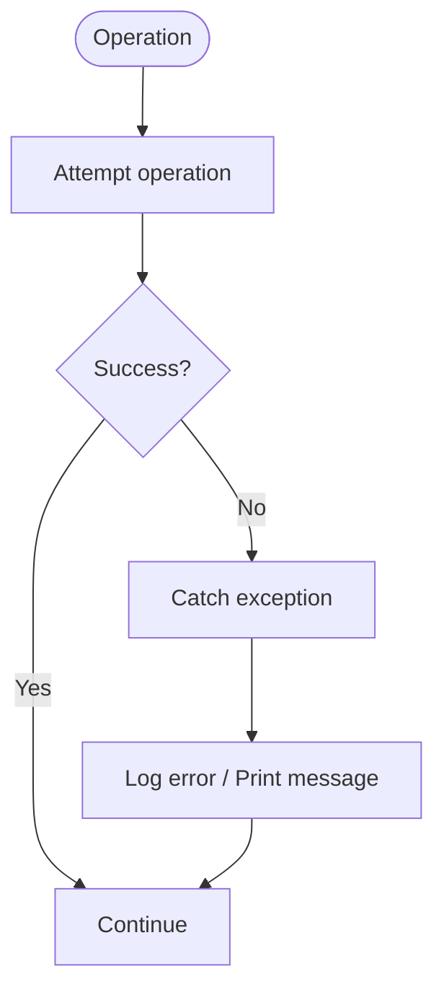
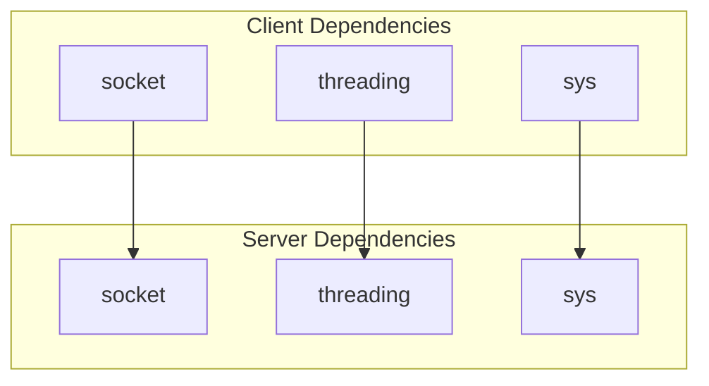

# Client Implementation

<cite>
**Referenced Files in This Document**
- [chat_client.py](file://chat_client.py)
- [chat_server.py](file://chat_server.py)
- [README.md](file://README.md)
</cite>

## Table of Contents
1. [Introduction](#introduction)
2. [Project Structure](#project-structure)
3. [Core Components](#core-components)
4. [Architecture Overview](#architecture-overview)
5. [Detailed Component Analysis](#detailed-component-analysis)
6. [Dependency Analysis](#dependency-analysis)
7. [Performance Considerations](#performance-considerations)
8. [Troubleshooting Guide](#troubleshooting-guide)
9. [Conclusion](#conclusion)

## Introduction
This document explains the client-side implementation of a TCP socket-based chat system. It covers the connection lifecycle, non-blocking message reception using threading, user input handling for sending messages and processing commands, and error handling for network disconnections. The goal is to help developers understand how the client establishes a connection, manages concurrent receive/send operations, and gracefully handles shutdown and cleanup.

## Project Structure
The project consists of two primary modules:
- chat_client.py: Implements the client-side TCP chat logic, including connection establishment, name assignment, message reception, and sending messages.
- chat_server.py: Implements the server-side chat logic, including accepting connections, broadcasting messages to connected clients, and managing client lists.

**Diagram sources**
- [chat_client.py](file://chat_client.py#L22-L54)
- [chat_server.py](file://chat_server.py#L48-L75)

**Section sources**
- [chat_client.py](file://chat_client.py#L1-L54)
- [chat_server.py](file://chat_server.py#L1-L75)
- [README.md](file://README.md#L1-L2)

## Core Components
- Connection establishment: The client creates a TCP socket and connects to the configured host and port.
- Name assignment: After connecting, the server prompts for a name; the client sends the user’s input to the server.
- Non-blocking receive loop: A dedicated thread continuously receives messages from the server and prints them to stdout.
- Message sending loop: The main thread reads user input and sends it to the server until interrupted.
- Graceful disconnect: On interruption, the client closes the socket and exits cleanly.

Key functions and responsibilities:
- receive_messages(conn): Runs in a separate thread to continuously receive and display messages.
- main(): Orchestrates connection, name assignment, starts the receive thread, and handles user input loop.

**Section sources**
- [chat_client.py](file://chat_client.py#L9-L20)
- [chat_client.py](file://chat_client.py#L22-L54)

## Architecture Overview
The client-server architecture is a simple relay model:
- The client connects to the server using a TCP socket.
- The server assigns a name to the client and maintains a shared list of connected clients.
- Messages sent by one client are broadcast to all other clients by the server.

**Diagram sources**
- [chat_client.py](file://chat_client.py#L22-L54)
- [chat_server.py](file://chat_server.py#L48-L75)

## Detailed Component Analysis

### Connection Establishment and Name Assignment
- The client determines host and port from command-line arguments or defaults, then creates a TCP socket and connects to the server.
- The server responds with a prompt requesting the user’s name. The client reads the prompt, flushes stdout, accepts user input, and sends the name to the server.
- The client prints a welcome message indicating the assigned name and instructions for sending messages.

**Diagram sources**
- [chat_client.py](file://chat_client.py#L22-L36)
- [chat_server.py](file://chat_server.py#L56-L65)

**Section sources**
- [chat_client.py](file://chat_client.py#L22-L36)
- [chat_server.py](file://chat_server.py#L56-L65)

### Non-blocking Message Reception with Threading
- The client starts a daemon thread running receive_messages(conn) to continuously read incoming data from the server.
- The receive loop decodes received bytes and writes them to stdout, flushing immediately to ensure real-time display.
- The loop terminates when the server closes the connection or when a connection error occurs.

**Diagram sources**
- [chat_client.py](file://chat_client.py#L9-L20)

**Section sources**
- [chat_client.py](file://chat_client.py#L9-L20)

### User Input Handling and Message Sending
- The main thread enters an input loop, reading user input and sending non-empty messages to the server.
- The loop catches interruption signals (Ctrl+C) and EOF conditions, printing a disconnect message before closing the socket in the finally block.

**Diagram sources**
- [chat_client.py](file://chat_client.py#L41-L49)

**Section sources**
- [chat_client.py](file://chat_client.py#L41-L49)

### Connection Lifecycle Management
- The client connects to the server, performs name assignment, and starts the receive thread.
- On interruption, the client prints a disconnect message and ensures the socket is closed in the finally block.
- The receive thread is a daemon thread, so it will terminate automatically when the main thread exits.

**Diagram sources**
- [chat_client.py](file://chat_client.py#L22-L54)

**Section sources**
- [chat_client.py](file://chat_client.py#L22-L54)

### Threading Model for Concurrent Receive/Send Operations
- Receive thread: Runs receive_messages(conn) as a daemon thread, continuously receiving and displaying messages.
- Send thread: The main thread handles user input and sends messages synchronously.
- Synchronization: No explicit synchronization is used between threads because:
  - The receive thread writes to stdout independently.
  - The send loop writes to the socket synchronously.
- Daemon threads: Ensures the program exits when the main thread exits, even if the receive thread is still running.

**Diagram sources**
- [chat_client.py](file://chat_client.py#L38-L39)
- [chat_client.py](file://chat_client.py#L9-L20)

**Section sources**
- [chat_client.py](file://chat_client.py#L38-L39)
- [chat_client.py](file://chat_client.py#L9-L20)

### Error Handling for Network Disconnections and Connection Failures
- Receive loop error handling: Catches connection reset and OS errors during recv, printing a connection lost message and exiting the receive loop.
- Send loop error handling: Catches interruption signals and EOF conditions, printing a disconnect message and ensuring the socket is closed.
- Connection failure: If the client cannot connect to the server, the connect call raises an exception; the current implementation does not include explicit try/catch around connect, so the program will exit on connection failure.

**Diagram sources**
- [chat_client.py](file://chat_client.py#L18-L19)
- [chat_client.py](file://chat_client.py#L46-L49)

**Section sources**
- [chat_client.py](file://chat_client.py#L18-L19)
- [chat_client.py](file://chat_client.py#L46-L49)

## Dependency Analysis
- The client module depends on:
  - socket for TCP communication
  - threading for concurrent receive operations
  - sys for command-line arguments and stdout
- The server module depends on:
  - socket for TCP communication
  - threading for client handling and broadcasting
  - sys for command-line arguments and stdout

**Diagram sources**
- [chat_client.py](file://chat_client.py#L1-L3)
- [chat_server.py](file://chat_server.py#L1-L3)

**Section sources**
- [chat_client.py](file://chat_client.py#L1-L3)
- [chat_server.py](file://chat_server.py#L1-L3)

## Performance Considerations
- Buffer sizes: The receive buffer is set to 4096 bytes for both client and server, which balances throughput and memory usage.
- Daemon threads: Using daemon threads avoids blocking program termination, but care should be taken to ensure all resources are cleaned up in the main thread.
- Broadcasting overhead: The server broadcasts each message to all clients under a lock; for large numbers of clients, consider optimizing broadcast performance.

[No sources needed since this section provides general guidance]

## Troubleshooting Guide
Common issues and resolutions:
- Cannot connect to server:
  - Verify the server is running and listening on the expected host and port.
  - Ensure the client passes the correct host and port via command-line arguments or uses defaults.
- Name assignment fails:
  - Confirm the server is prompting for a name and the client sends a non-empty name.
- Messages not appearing:
  - Check that the receive thread is started and running.
  - Ensure stdout is flushed after writing received messages.
- Disconnection during input:
  - Press Ctrl+C to trigger the interrupt handler and close the socket cleanly.

**Section sources**
- [chat_client.py](file://chat_client.py#L22-L54)
- [chat_server.py](file://chat_server.py#L48-L75)

## Conclusion
The client implementation provides a straightforward TCP chat client with a clear separation between receiving and sending operations. The receive loop runs in a daemon thread to enable real-time message display, while the main thread handles user input and graceful shutdown. Error handling is present for connection loss and interruption scenarios. Together with the server implementation, this forms a functional relay-based chat system suitable for demonstration and learning purposes.