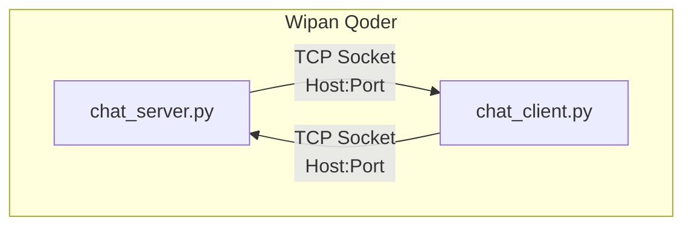
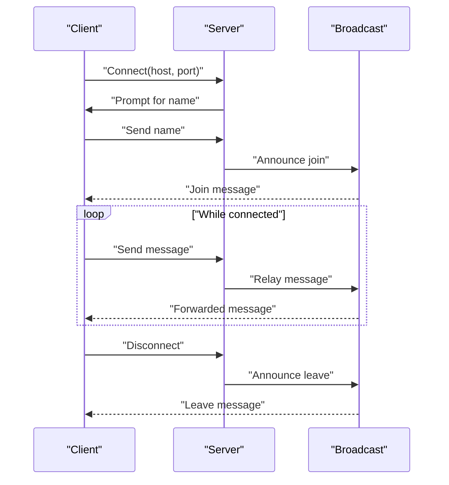
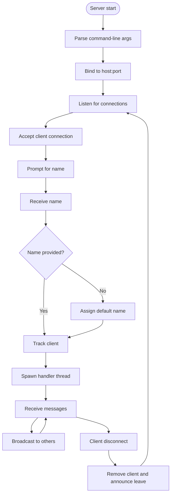
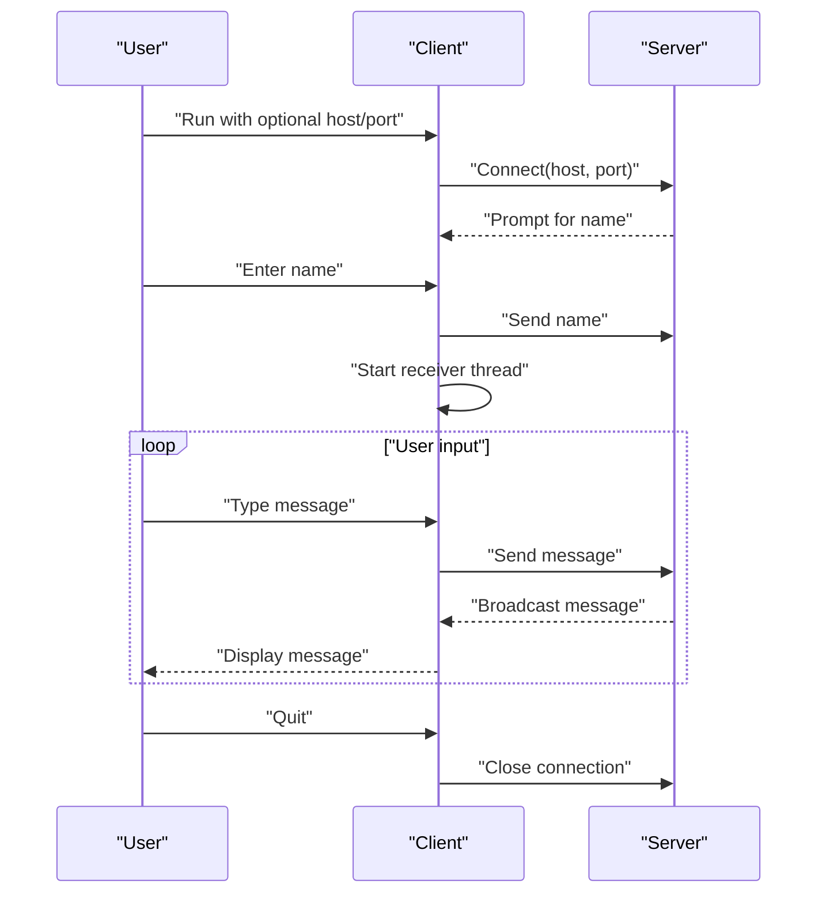
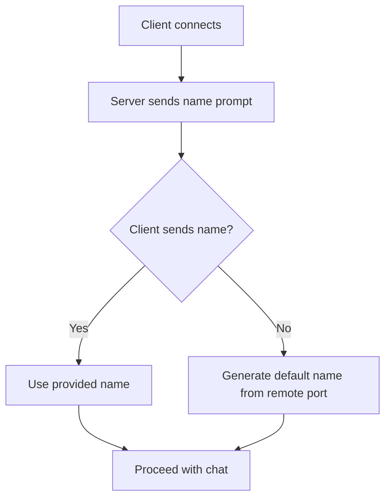
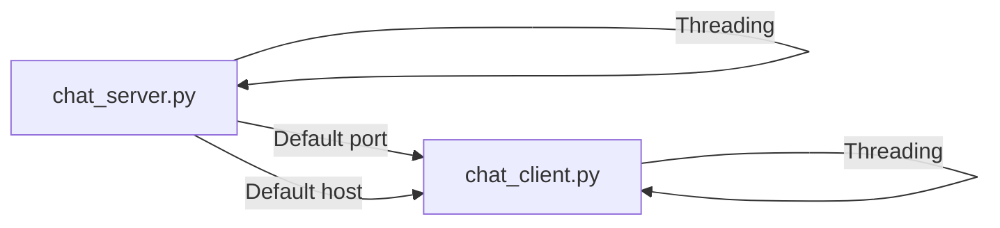

# Configuration and Customization

<cite>
**Referenced Files in This Document**
- [chat_server.py](file://chat_server.py)
- [chat_client.py](file://chat_client.py)
- [README.md](file://README.md)
</cite>

## Table of Contents
1. [Introduction](#introduction)
2. [Project Structure](#project-structure)
3. [Core Components](#core-components)
4. [Architecture Overview](#architecture-overview)
5. [Detailed Component Analysis](#detailed-component-analysis)
6. [Dependency Analysis](#dependency-analysis)
7. [Performance Considerations](#performance-considerations)
8. [Troubleshooting Guide](#troubleshooting-guide)
9. [Conclusion](#conclusion)
10. [Appendices](#appendices)

## Introduction
This document explains how to configure and customize the Wipan Qoder chat system. It covers default host and port values, command-line arguments for runtime customization, client name assignment behavior, and practical guidance for running servers on custom ports and connecting clients to different hosts. It also addresses network configuration considerations such as firewall settings and port availability, and provides guidance for adapting the system to different deployment scenarios and scaling considerations.

## Project Structure
The system consists of two primary scripts:
- A chat server that listens for connections and relays messages between clients.
- A chat client that connects to the server, exchanges messages, and assigns a display name.

**Diagram sources**
- [chat_server.py](file://chat_server.py#L48-L75)
- [chat_client.py](file://chat_client.py#L22-L54)

**Section sources**
- [chat_server.py](file://chat_server.py#L1-L75)
- [chat_client.py](file://chat_client.py#L1-L54)
- [README.md](file://README.md#L1-L2)

## Core Components
- Server defaults and runtime customization:
  - Default host and port are embedded in the server script.
  - The server accepts a single command-line argument to override the port.
- Client defaults and runtime customization:
  - Default host and port are embedded in the client script.
  - The client accepts two command-line arguments to override host and port.
- Name assignment:
  - The server prompts each client for a name upon connection.
  - If the client does not provide a name, the server assigns a default name based on the client’s remote port.

**Section sources**
- [chat_server.py](file://chat_server.py#L5-L6)
- [chat_server.py](file://chat_server.py#L48-L75)
- [chat_client.py](file://chat_client.py#L5-L6)
- [chat_client.py](file://chat_client.py#L22-L54)

## Architecture Overview
The system uses a simple TCP socket-based architecture:
- The server binds to a host:port and accepts incoming connections.
- Each client connection is handled in a separate thread.
- Messages are broadcast to all connected clients except the sender.

**Diagram sources**
- [chat_server.py](file://chat_server.py#L22-L46)
- [chat_server.py](file://chat_server.py#L48-L75)
- [chat_client.py](file://chat_client.py#L22-L54)

## Detailed Component Analysis

### Server Configuration and Behavior
- Defaults:
  - Host: a loopback address suitable for local development.
  - Port: a conventional port number for testing.
- Command-line customization:
  - The server reads one optional argument to override the port.
- Binding and listening:
  - The server sets reuse-address behavior to avoid bind failures after restart.
  - It listens for incoming connections with a small backlog.
- Client handling:
  - On accept, the server sends a name prompt to the client.
  - The server assigns a default name if the client does not provide one.
  - Each client is tracked in a shared list guarded by a lock.
  - Messages are broadcast to all other clients.

**Diagram sources**
- [chat_server.py](file://chat_server.py#L48-L75)
- [chat_server.py](file://chat_server.py#L12-L46)

**Section sources**
- [chat_server.py](file://chat_server.py#L5-L6)
- [chat_server.py](file://chat_server.py#L48-L75)
- [chat_server.py](file://chat_server.py#L12-L46)

### Client Configuration and Behavior
- Defaults:
  - Host: a loopback address suitable for local development.
  - Port: the same default as the server.
- Command-line customization:
  - The client reads up to two optional arguments to override host and port.
- Connection and name assignment:
  - The client connects to the server and receives a name prompt.
  - The client sends the provided name to the server.
- Message exchange:
  - The client runs a dedicated receiver thread to continuously read messages.
  - The main thread reads user input and sends messages to the server.

**Diagram sources**
- [chat_client.py](file://chat_client.py#L22-L54)
- [chat_client.py](file://chat_client.py#L9-L20)

**Section sources**
- [chat_client.py](file://chat_client.py#L5-L6)
- [chat_client.py](file://chat_client.py#L22-L54)
- [chat_client.py](file://chat_client.py#L9-L20)

### Name Assignment Process
- During connection, the server sends a prompt requesting the client’s name.
- The client responds with the chosen name.
- If the client does not provide a name, the server assigns a default name derived from the client’s remote port number.

**Diagram sources**
- [chat_server.py](file://chat_server.py#L59-L65)
- [chat_client.py](file://chat_client.py#L29-L34)

**Section sources**
- [chat_server.py](file://chat_server.py#L59-L65)
- [chat_client.py](file://chat_client.py#L29-L34)

## Dependency Analysis
- Runtime dependencies:
  - Both scripts rely on Python’s standard networking libraries.
  - The server uses threading to handle multiple clients concurrently.
- Coupling:
  - The server and client share a common default port, simplifying local testing.
  - There is no external configuration file; customization is performed via command-line arguments.

**Diagram sources**
- [chat_server.py](file://chat_server.py#L48-L75)
- [chat_client.py](file://chat_client.py#L22-L54)

**Section sources**
- [chat_server.py](file://chat_server.py#L1-L75)
- [chat_client.py](file://chat_client.py#L1-L54)

## Performance Considerations
- Concurrency model:
  - The server spawns a thread per client, which is suitable for small-scale testing but not optimal for high concurrency.
- Backpressure and buffering:
  - Messages are buffered in memory; large bursts may temporarily increase memory usage.
- Scalability:
  - For production-like loads, consider event-driven architectures or asynchronous IO to reduce thread overhead.

[No sources needed since this section provides general guidance]

## Troubleshooting Guide
- Port already in use:
  - The server sets reuse-address behavior to mitigate bind conflicts after restarts.
  - Choose a different port if the default is occupied.
- Firewall or network restrictions:
  - Ensure the server’s listen port is open on the host’s firewall.
  - For remote clients, confirm inbound access to the server’s public IP and port.
- Name assignment issues:
  - If the server does not receive a name promptly, it may assign a default name based on the client’s remote port.
- Connection errors:
  - Verify host and port arguments match between client and server.
  - Confirm the server is running and reachable from the client’s network.

**Section sources**
- [chat_server.py](file://chat_server.py#L50-L53)
- [chat_server.py](file://chat_server.py#L59-L65)
- [chat_client.py](file://chat_client.py#L22-L24)

## Conclusion
The Wipan Qoder system provides a minimal yet functional chat server and client with straightforward configuration via command-line arguments. Defaults are designed for local development, and customization is achieved by overriding host and port values at runtime. For broader deployment and scaling, consider adopting asynchronous IO and external configuration mechanisms.

[No sources needed since this section summarizes without analyzing specific files]

## Appendices

### A. Default Values and Command-Line Options
- Server defaults:
  - Host: loopback address
  - Port: default port number
  - Override port via a single command-line argument.
- Client defaults:
  - Host: loopback address
  - Port: default port number
  - Override host and/or port via command-line arguments.

**Section sources**
- [chat_server.py](file://chat_server.py#L5-L6)
- [chat_server.py](file://chat_server.py#L48-L49)
- [chat_client.py](file://chat_client.py#L5-L6)
- [chat_client.py](file://chat_client.py#L22-L24)

### B. Running the Server on a Custom Port
- Start the server with a custom port argument to listen on a different port.
- Ensure the chosen port is free and allowed by the system firewall.

**Section sources**
- [chat_server.py](file://chat_server.py#L48-L54)

### C. Connecting Clients to Different Hosts and Ports
- Run the client with host and port arguments to connect to a remote server or a server on a non-default port.
- Confirm the server is reachable from the client’s network.

**Section sources**
- [chat_client.py](file://chat_client.py#L22-L24)
- [chat_client.py](file://chat_client.py#L26-L27)

### D. Environment Variables
- No environment variable support is present in the current implementation.
- Configuration remains strictly via command-line arguments.

**Section sources**
- [chat_server.py](file://chat_server.py#L48-L49)
- [chat_client.py](file://chat_client.py#L22-L24)

### E. Network Configuration Considerations
- Local development:
  - Use loopback host and default port for quick testing.
- Remote deployment:
  - Open the server’s listen port on the host firewall.
  - Configure routing and DNS so clients can reach the server’s public address.
- Port availability:
  - Prefer higher-numbered ports to avoid conflicts with privileged services.
  - Ensure the selected port is not blocked by corporate or cloud firewalls.

**Section sources**
- [chat_server.py](file://chat_server.py#L50-L53)
- [chat_client.py](file://chat_client.py#L22-L24)

### F. Adapting for Different Deployment Scenarios and Scaling
- Single-instance local testing:
  - Use default host and port; no special configuration required.
- Multi-client LAN:
  - Bind the server to the LAN interface and adjust firewall rules accordingly.
- Remote hosting:
  - Expose the server’s port publicly or via a reverse proxy; ensure TLS termination if needed.
- Scaling:
  - Replace the threaded model with an asynchronous IO framework to handle more concurrent clients efficiently.

**Section sources**
- [chat_server.py](file://chat_server.py#L48-L75)
- [chat_client.py](file://chat_client.py#L22-L54)