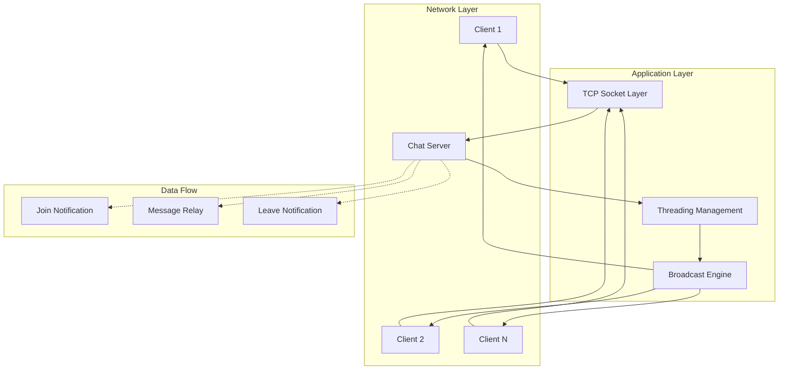

# Getting Started

<cite>
**Referenced Files in This Document**
- [README.md](file://README.md)
- [chat_server.py](file://chat_server.py)
- [chat_client.py](file://chat_client.py)
</cite>

## Table of Contents
1. [Introduction](#introduction)
2. [System Requirements](#system-requirements)
3. [Installation](#installation)
4. [Running the Server](#running-the-server)
5. [Connecting Clients](#connecting-clients)
6. [Basic Usage Scenarios](#basic-usage-scenarios)
7. [Verification Steps](#verification-steps)
8. [Common Setup Issues and Troubleshooting](#common-setup-issues-and-troubleshooting)
9. [Architecture Overview](#architecture-overview)
10. [Conclusion](#conclusion)

## Introduction
Wipan Qoder is a simple TCP socket-based chat system designed for learning and experimentation. It consists of a server that relays messages between connected clients. The system is ideal for beginners to understand network programming concepts, threading, and client-server communication patterns.

The chat system follows a straightforward architecture where:
- A central server listens for client connections
- Clients connect to the server and exchange messages
- The server broadcasts received messages to all other connected clients
- Each client displays incoming messages in real-time

This documentation provides step-by-step instructions for setting up and using the chat system, along with troubleshooting guidance for common issues.

## System Requirements
The chat system requires minimal system resources and can run on most modern operating systems. Here are the basic requirements:

### Software Requirements
- Python 3.x runtime environment
- Standard Python libraries (socket, threading, sys)
- Network connectivity for local or remote connections

### Hardware Requirements
- Minimal CPU resources for basic message relaying
- Sufficient memory for concurrent client connections
- Network interface capable of TCP/IP communication

### Network Requirements
- Local loopback interface (127.0.0.1) for local testing
- TCP port availability (default: 9999)
- Firewall configuration allowing inbound connections on the chosen port

## Installation
The chat system is distributed as a single Python package with two main components. Installation is straightforward and requires no external dependencies beyond Python itself.

### Step-by-Step Installation Process
1. **Verify Python Installation**: Ensure Python 3.x is installed on your system
2. **Download Files**: Obtain the chat_server.py and chat_client.py files
3. **Place Files**: Put both files in the same directory
4. **Optional Directory Structure**: The system includes a .qoder directory for future agent and skill extensions

### Directory Structure
```
wipan_qoder/
├── chat_server.py          # Central chat server
├── chat_client.py          # Chat client implementation
├── README.md               # Project documentation
└── .qoder/                 # Future extension directory
    ├── agents/             # Agent configurations
    └── skills/             # Skill definitions
```

### Verification
After installation, verify the system by checking that both Python files are present and readable. The .qoder directory is optional and can remain empty initially.

## Running the Server
The chat server operates as a standalone TCP service that accepts client connections and manages message broadcasting.

### Default Server Configuration
The server uses the following default settings:
- Host: 127.0.0.1 (localhost)
- Port: 9999
- Maximum concurrent connections: 5

### Starting the Server
To start the server with default settings:
```bash
python chat_server.py
```

### Custom Port Configuration
To run the server on a custom port, specify the port number as a command-line argument:
```bash
python chat_server.py 8080
```

### Server Output
When successfully started, the server displays a startup message indicating the listening address and port. The server continues running until manually terminated.

### Server Shutdown
The server handles graceful shutdown through keyboard interrupt (Ctrl+C). During shutdown, the server prints a termination message and closes all active connections.

**Section sources**
- [chat_server.py](file://chat_server.py#L48-L75)

## Connecting Clients
Client connections follow a standardized process where each client establishes a TCP connection to the server and participates in the chat session.

### Default Client Configuration
Each client uses these default connection parameters:
- Host: 127.0.0.1 (localhost)
- Port: 9999

### Basic Client Connection
Connect to the server using the default settings:
```bash
python chat_client.py
```

### Custom Host and Port
Specify custom connection parameters using command-line arguments:
```bash
python chat_client.py 192.168.1.100 8080
```

### Connection Process
The client connection sequence follows these steps:
1. Establish TCP connection to the server
2. Receive name prompt from server
3. Enter display name (or accept generated name)
4. Begin receiving and sending messages

### Client Behavior
Upon successful connection, the client:
- Starts a background thread for receiving messages
- Displays a welcome message with connection details
- Allows continuous message input until disconnect
- Handles disconnection gracefully

**Section sources**
- [chat_client.py](file://chat_client.py#L22-L54)

## Basic Usage Scenarios
The chat system supports multiple concurrent clients exchanging messages in real-time. Here are common usage patterns:

### Scenario 1: Basic Two-Client Chat
1. **Start Server**: Launch the chat server
2. **Client A**: Connect with default settings
3. **Client B**: Connect with default settings
4. **Exchange Messages**: Both clients can send and receive messages

### Scenario 2: Custom Port Testing
1. **Start Server**: Run server on custom port
   ```bash
   python chat_server.py 7777
   ```
2. **Client Connection**: Connect clients to custom port
   ```bash
   python chat_client.py 127.0.0.1 7777
   ```

### Scenario 3: Remote Connection Testing
1. **Server Configuration**: Start server on all interfaces
   ```bash
   python chat_server.py 9999
   ```
2. **Client Connection**: Connect from remote machine
   ```bash
   python chat_client.py SERVER_IP_ADDRESS 9999
   ```

### Message Exchange Protocol
Messages follow a standardized format:
- Server announces client joins and leaves
- Client messages include the sender's name
- Real-time message broadcasting to all participants

**Section sources**
- [chat_server.py](file://chat_server.py#L22-L46)
- [chat_client.py](file://chat_client.py#L9-L20)

## Verification Steps
Ensure proper installation and operation through these verification procedures:

### Server Verification
1. **Port Availability**: Confirm the server port is free before starting
2. **Startup Confirmation**: Verify server displays listening address
3. **Connection Test**: Attempt client connection to confirm server responsiveness
4. **Graceful Shutdown**: Test Ctrl+C shutdown behavior

### Client Verification
1. **Connection Establishment**: Verify client connects without errors
2. **Name Registration**: Confirm successful name prompt and registration
3. **Message Reception**: Test receiving messages from other clients
4. **Message Broadcasting**: Verify sent messages reach other clients

### Network Verification
1. **Local Loopback**: Test localhost connections (127.0.0.1)
2. **Firewall Check**: Ensure firewall allows connections on configured port
3. **Port Scanning**: Verify port accessibility using network tools
4. **Remote Access**: Test connections from different network locations

### Multi-Client Testing
1. **Two-Client Setup**: Connect two clients and verify bidirectional messaging
2. **Client Leaving**: Test client disconnection and server cleanup
3. **Concurrent Messages**: Send simultaneous messages from multiple clients
4. **Server Restart**: Verify server can handle restarts and reconnections

## Common Setup Issues and Troubleshooting

### Issue 1: Port Already in Use
**Symptoms**: Server fails to start with port binding error
**Solution**: Choose an alternative port or terminate existing process
```bash
python chat_server.py 8888
```

### Issue 2: Connection Refused
**Symptoms**: Client cannot connect to server
**Solutions**:
- Verify server is running before connecting
- Check firewall settings for the configured port
- Confirm correct host and port parameters
- Test with localhost connection first

### Issue 3: Name Prompt Not Appearing
**Symptoms**: Client connects but doesn't ask for name
**Solutions**:
- Ensure server is running with default or custom port
- Check network connectivity between client and server
- Verify no firewall blocking the connection

### Issue 4: Messages Not Receiving
**Symptoms**: Client connects but doesn't display received messages
**Solutions**:
- Verify server is broadcasting messages correctly
- Check client-side threading for message reception
- Ensure no network interruptions during connection

### Issue 5: Server Crashes on Client Disconnect
**Symptoms**: Server terminates unexpectedly when clients disconnect
**Solutions**:
- Use Ctrl+C for graceful shutdown instead of force termination
- Check for proper exception handling in client code
- Verify server-side connection cleanup

### Issue 6: Permission Denied Errors
**Symptoms**: Server fails to bind to privileged port (<1024)
**Solutions**:
- Use ports above 1024 (standard practice)
- Run with appropriate privileges if necessary
- Configure port forwarding if accessing from restricted environments

### Debugging Commands
Use these commands to diagnose common issues:
```bash
# Check if port is in use
netstat -an | grep :9999

# Test local connection
telnet 127.0.0.1 9999

# Monitor server logs
python chat_server.py 2>&1 | tee server.log
```

**Section sources**
- [chat_server.py](file://chat_server.py#L12-L46)
- [chat_client.py](file://chat_client.py#L9-L20)

## Architecture Overview
The chat system implements a classic client-server architecture with message broadcasting capabilities.



**Diagram sources**
- [chat_server.py](file://chat_server.py#L12-L46)
- [chat_client.py](file://chat_client.py#L9-L20)

### Component Interactions
The system demonstrates several key networking concepts:

1. **Server-Side Operations**:
   - Socket creation and binding
   - Connection acceptance and management
   - Thread-safe message broadcasting
   - Graceful connection cleanup

2. **Client-Side Operations**:
   - Connection establishment
   - Concurrent message reception
   - User input handling
   - Connection termination

3. **Communication Patterns**:
   - Request-response for name registration
   - Persistent connection for message exchange
   - Broadcast pattern for multi-client messaging

**Section sources**
- [chat_server.py](file://chat_server.py#L48-L75)
- [chat_client.py](file://chat_client.py#L22-L54)

## Conclusion
The Wipan Qoder chat system provides an excellent foundation for learning network programming concepts. Its simple architecture makes it accessible to beginners while demonstrating essential principles of client-server communication, threading, and message broadcasting.

Key benefits of this implementation:
- Minimal dependencies and easy setup
- Clear separation between server and client concerns
- Real-time message broadcasting capabilities
- Graceful error handling and connection management
- Extensible architecture for future enhancements

For beginners, this system serves as an ideal starting point for understanding:
- TCP socket programming fundamentals
- Threading concepts in network applications
- Client-server communication patterns
- Error handling in network programming
- Practical debugging techniques

Future enhancements could include message persistence, user authentication, channel-based conversations, and graphical user interfaces, building upon this solid foundation.