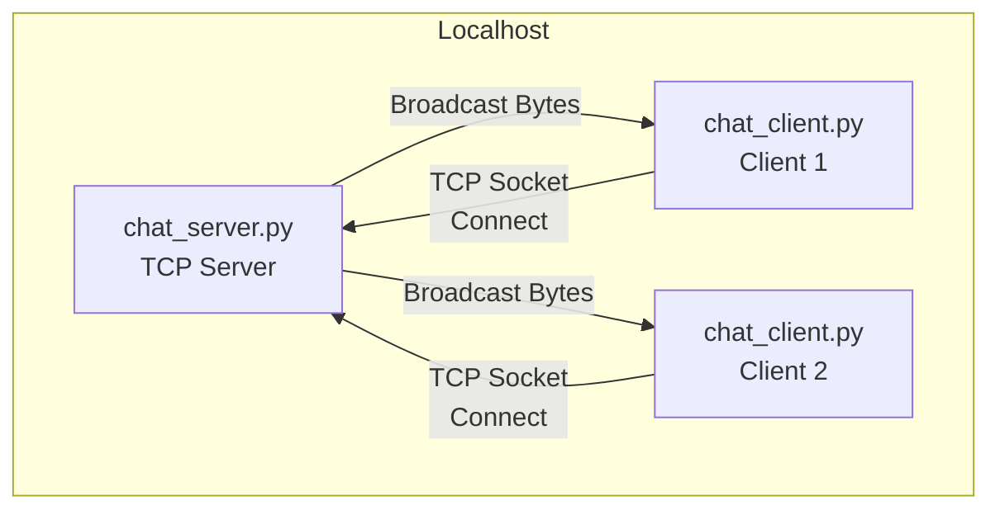
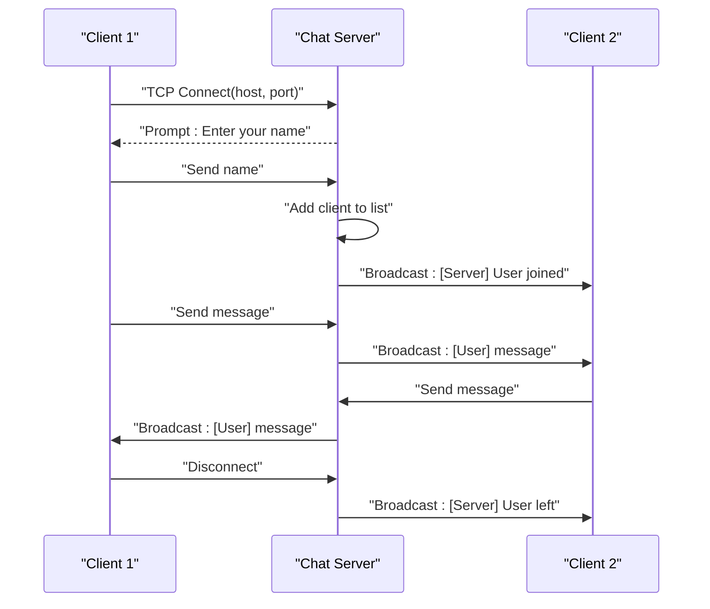
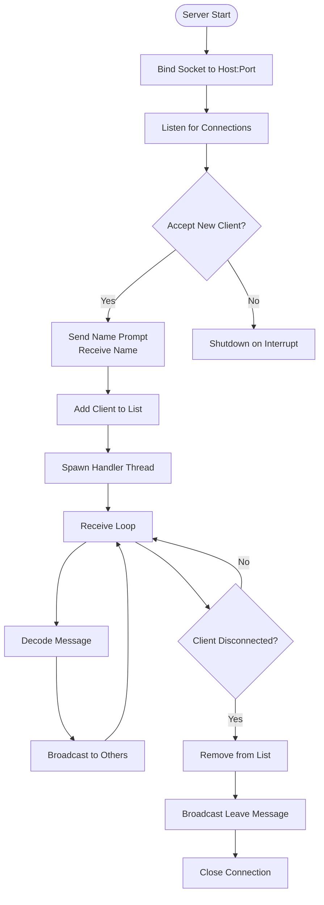
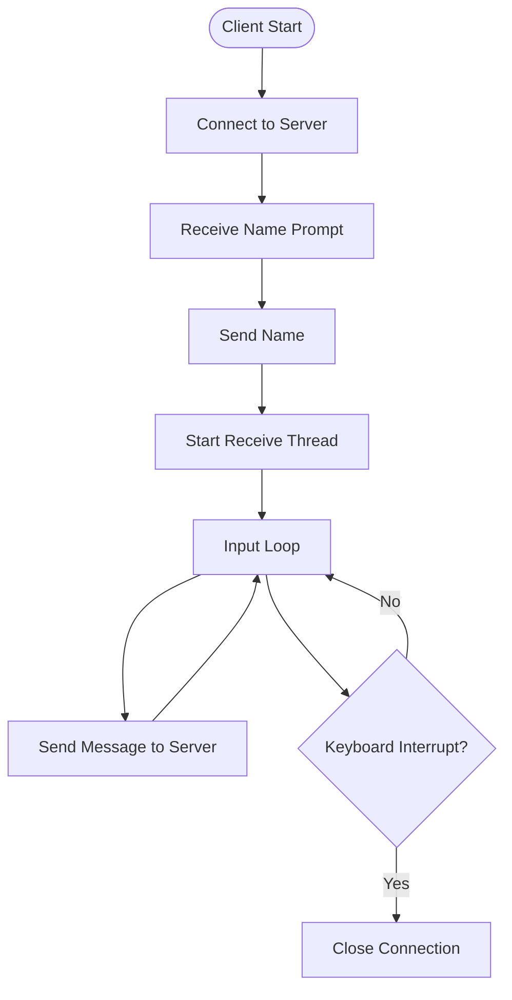
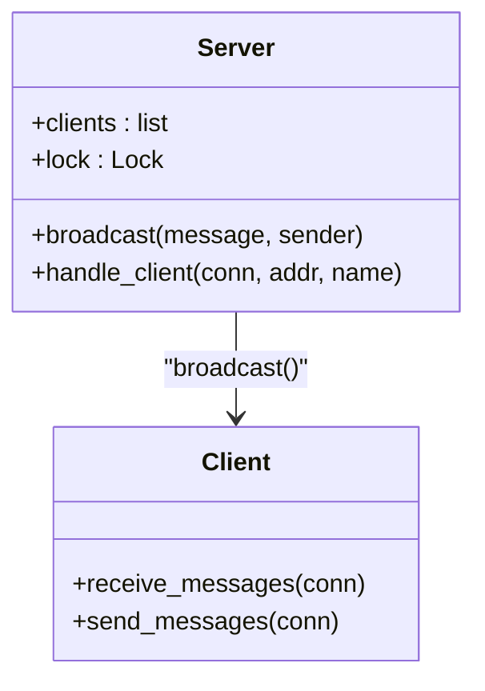
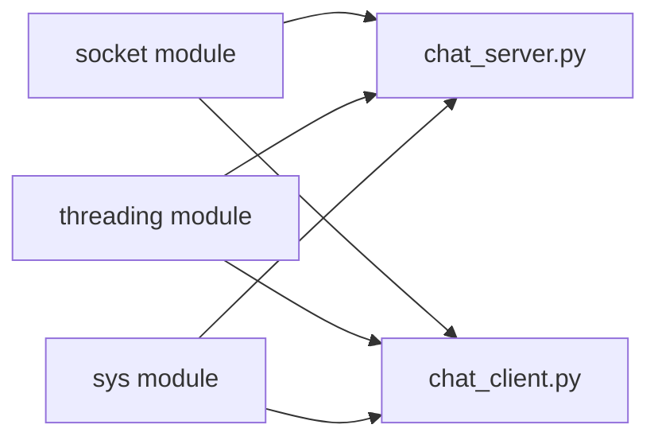

# Project Overview

<cite>
**Referenced Files in This Document**
- [README.md](file://README.md)
- [chat_client.py](file://chat_client.py)
- [chat_server.py](file://chat_server.py)
</cite>

## Table of Contents
1. [Introduction](#introduction)
2. [Project Structure](#project-structure)
3. [Core Components](#core-components)
4. [Architecture Overview](#architecture-overview)
5. [Detailed Component Analysis](#detailed-component-analysis)
6. [Dependency Analysis](#dependency-analysis)
7. [Performance Considerations](#performance-considerations)
8. [Troubleshooting Guide](#troubleshooting-guide)
9. [Conclusion](#conclusion)

## Introduction
Wipan Qoder is a simple TCP socket-based chat system designed as an educational tool for beginners learning networking concepts. The project demonstrates fundamental client-server communication patterns using Python’s socket programming APIs. It consists of two primary scripts: a chat server that manages multiple connected clients and a chat client that connects to the server to participate in real-time messaging.

The project’s educational goals include:
- Understanding TCP socket programming fundamentals
- Learning client-server architecture patterns
- Practicing asynchronous message handling with threads
- Observing message broadcasting and relay mechanisms
- Gaining hands-on experience with network protocol basics

Target audience:
- Developers new to networking concepts
- Students learning socket programming and concurrency
- Anyone interested in building simple networked applications

System requirements:
- Python interpreter capable of running socket and threading modules
- Basic familiarity with command-line usage
- Network connectivity to localhost for local testing

Scope and limitations:
- Single-host deployment (localhost) for simplicity
- Text-based chat interface
- No persistent storage or authentication
- Minimal error handling focused on core functionality
- Designed for demonstration rather than production-grade reliability

## Project Structure
The repository contains minimal yet focused files that implement the chat system:

- chat_server.py: Implements the server-side logic, including socket binding, client acceptance, thread-safe client management, and message broadcasting.
- chat_client.py: Implements the client-side logic, including connection establishment, interactive message input, and background message reception.
- README.md: Provides a brief description of the project’s purpose and intended behavior.

**Diagram sources**
- [chat_server.py](file://chat_server.py#L48-L75)
- [chat_client.py](file://chat_client.py#L22-L54)

**Section sources**
- [README.md](file://README.md#L1-L2)
- [chat_server.py](file://chat_server.py#L1-L75)
- [chat_client.py](file://chat_client.py#L1-L54)

## Core Components
- Chat Server
  - Creates a TCP socket bound to a configurable host and port
  - Listens for incoming connections and spawns a dedicated handler thread per client
  - Maintains a thread-safe list of connected clients and broadcasts messages to all except the sender
  - Handles client join/leave events and graceful shutdown on keyboard interrupt

- Chat Client
  - Establishes a TCP connection to the configured server address and port
  - Requests a user name during initial handshake and sends it to the server
  - Runs a background thread to continuously receive and display messages from the server
  - Sends typed messages to the server until interrupted

Key implementation highlights:
- Threading model: Separate threads for receiving messages and sending messages
- Concurrency control: A lock protects shared client list updates
- Message relay: Broadcast function forwards received messages to all other clients
- Graceful termination: Proper cleanup on disconnect or keyboard interrupt

**Section sources**
- [chat_server.py](file://chat_server.py#L12-L46)
- [chat_server.py](file://chat_server.py#L48-L75)
- [chat_client.py](file://chat_client.py#L9-L20)
- [chat_client.py](file://chat_client.py#L22-L54)

## Architecture Overview
The system follows a classic client-server architecture over TCP sockets. The server listens for connections, assigns a name to each client, and relays messages among all connected clients. Clients communicate asynchronously: one thread handles incoming messages while another handles outgoing input.

**Diagram sources**
- [chat_server.py](file://chat_server.py#L56-L66)
- [chat_server.py](file://chat_server.py#L22-L45)
- [chat_client.py](file://chat_client.py#L26-L49)

## Detailed Component Analysis

### Server-Side Behavior
The server initializes a TCP socket, binds it to a host and port, and begins accepting connections. For each accepted connection, it prompts the client for a name, adds the client to an internal list, and starts a dedicated handler thread. The handler thread receives messages from the client, logs them, and broadcasts them to all other clients. On disconnect, the server removes the client from the list and notifies others.

**Diagram sources**
- [chat_server.py](file://chat_server.py#L48-L75)
- [chat_server.py](file://chat_server.py#L12-L20)
- [chat_server.py](file://chat_server.py#L22-L45)

**Section sources**
- [chat_server.py](file://chat_server.py#L12-L46)
- [chat_server.py](file://chat_server.py#L48-L75)

### Client-Side Behavior
The client establishes a TCP connection to the server, receives a name prompt, and sends a name. It then starts a background thread to continuously receive messages from the server and prints them to stdout. The main thread waits for user input and sends messages to the server until interrupted.

**Diagram sources**
- [chat_client.py](file://chat_client.py#L22-L54)
- [chat_client.py](file://chat_client.py#L9-L20)

**Section sources**
- [chat_client.py](file://chat_client.py#L9-L20)
- [chat_client.py](file://chat_client.py#L22-L54)

### Message Relay Mechanism
The server maintains a shared list of client connections protected by a lock. When a client sends a message, the server decodes it, prepends the sender’s name, and broadcasts the formatted message to all other clients. This ensures that each client sees messages from everyone else in the chat.

**Diagram sources**
- [chat_server.py](file://chat_server.py#L8-L19)
- [chat_server.py](file://chat_server.py#L22-L45)
- [chat_client.py](file://chat_client.py#L9-L20)

**Section sources**
- [chat_server.py](file://chat_server.py#L12-L20)
- [chat_server.py](file://chat_server.py#L22-L45)

## Dependency Analysis
The project relies on standard Python libraries:
- socket: Provides low-level networking primitives for TCP communication
- threading: Enables concurrent message handling for multiple clients and bidirectional client IO
- sys: Used for argument parsing and standard I/O

External integration points:
- Localhost network interface for binding and connecting
- Standard terminal for interactive input and output

**Diagram sources**
- [chat_server.py](file://chat_server.py#L1-L3)
- [chat_client.py](file://chat_client.py#L1-L3)

**Section sources**
- [chat_server.py](file://chat_server.py#L1-L3)
- [chat_client.py](file://chat_client.py#L1-L3)

## Performance Considerations
- Throughput: Broadcasting to multiple clients scales linearly with the number of clients. For small-scale demos, this is sufficient.
- Latency: Message delivery depends on network round-trip time and thread scheduling. Background receive threads minimize blocking the main thread.
- Resource usage: Each client connection consumes memory and CPU for a handler thread. Limit the number of concurrent clients for lightweight environments.
- Scalability: The current design is not optimized for high concurrency. Production systems would benefit from event-driven architectures or async I/O.

## Troubleshooting Guide
Common issues and resolutions:
- Connection refused: Ensure the server is running and listening on the expected host and port before starting clients.
- Name prompt not received: Verify that the client connects successfully and that the server is prompting for a name.
- Messages not appearing: Confirm that the receive thread is running and that the server is broadcasting messages to other clients.
- Keyboard interrupt behavior: Use Ctrl+C to exit cleanly; the server and client should close connections gracefully.

Operational tips:
- Start the server first, then launch multiple clients to observe message relay.
- Use different names to distinguish participants in the chat.
- Test disconnection scenarios by closing a client to confirm leave notifications.

**Section sources**
- [chat_server.py](file://chat_server.py#L48-L75)
- [chat_client.py](file://chat_client.py#L22-L54)

## Conclusion
Wipan Qoder delivers a clear, minimal example of TCP socket programming and client-server communication. It introduces learners to essential networking concepts—sockets, threading, message broadcasting, and graceful shutdown—through a practical, interactive chat system. While intentionally simple, it serves as an excellent foundation for exploring more advanced topics such as asynchronous I/O, authentication, and distributed messaging.