# Server Implementation

<cite>
**Referenced Files in This Document**
- [chat_server.py](file://chat_server.py)
- [chat_client.py](file://chat_client.py)
- [README.md](file://README.md)
</cite>

## Table of Contents
1. [Introduction](#introduction)
2. [Project Structure](#project-structure)
3. [Core Components](#core-components)
4. [Architecture Overview](#architecture-overview)
5. [Detailed Component Analysis](#detailed-component-analysis)
6. [Dependency Analysis](#dependency-analysis)
7. [Performance Considerations](#performance-considerations)
8. [Troubleshooting Guide](#troubleshooting-guide)
9. [Conclusion](#conclusion)

## Introduction
This document provides comprehensive technical documentation for the TCP socket-based chat server implementation. The system consists of a central server that manages multiple concurrent client connections and broadcasts messages between connected participants. The implementation demonstrates fundamental networking concepts including socket creation, connection handling, thread synchronization, and message distribution.

The chat server follows a simple yet robust architecture where a single server socket accepts incoming connections, spawns dedicated threads for each client, and maintains a synchronized collection of active connections for message broadcasting.

## Project Structure
The project maintains a minimal but complete implementation with two primary components:


**Diagram sources**
- [chat_server.py](file://chat_server.py#L1-L75)
- [chat_client.py](file://chat_client.py#L1-L54)

**Section sources**
- [chat_server.py](file://chat_server.py#L1-L75)
- [chat_client.py](file://chat_client.py#L1-L54)
- [README.md](file://README.md#L1-L2)

## Core Components
The chat server implementation centers around four fundamental components that work together to provide reliable message broadcasting:

### Server Configuration and Global State
The server maintains essential configuration constants and shared state:
- Host binding address for local development
- Default port configuration
- Global client collection for connection management
- Thread lock for synchronization

### Message Broadcasting System
The broadcast mechanism ensures efficient message distribution to all connected clients while excluding the original sender. This system handles network exceptions gracefully and maintains service continuity.

### Client Connection Handler
Each client connection is managed by an independent thread that processes incoming messages, handles user interactions, and manages connection lifecycle events.

### Thread-Safe Client Management
The implementation employs a lock-based synchronization mechanism to protect the shared client collection, preventing race conditions during concurrent access scenarios.

**Section sources**
- [chat_server.py](file://chat_server.py#L5-L9)

## Architecture Overview
The chat server follows a multi-threaded architecture pattern designed for scalability and reliability:

```mermaid
sequenceDiagram
participant Client as "Client Application"
participant Server as "Main Server"
participant Handler as "Client Handler Thread"
participant Broadcast as "Broadcast System"
participant Sync as "Thread Lock"
Client->>Server : Connect to server socket
Server->>Server : Accept connection
Server->>Client : Request client name
Client->>Server : Send client name
Server->>Sync : Acquire lock
Server->>Server : Add client to collection
Server->>Sync : Release lock
Server->>Handler : Spawn handler thread
Handler->>Broadcast : Notify join event
Broadcast->>Sync : Acquire lock
Broadcast->>Client : Send join notification
Broadcast->>Sync : Release lock
loop Message Exchange
Client->>Handler : Send message
Handler->>Handler : Process message
Handler->>Broadcast : Relay message
Broadcast->>Sync : Acquire lock
Broadcast->>Client : Forward to all except sender
Broadcast->>Sync : Release lock
end
Client->>Handler : Disconnect
Handler->>Sync : Acquire lock
Handler->>Server : Remove client from collection
Handler->>Sync : Release lock
Handler->>Broadcast : Notify leave event
Broadcast->>Sync : Acquire lock
Broadcast->>Client : Send leave notification
Broadcast->>Sync : Release lock
Handler->>Handler : Close connection
```



**Diagram sources**
- [chat_server.py](file://chat_server.py#L48-L71)
- [chat_server.py](file://chat_server.py#L22-L46)
- [chat_server.py](file://chat_server.py#L12-L20)

## Detailed Component Analysis

### Server Startup and Socket Configuration
The server initialization process establishes the foundation for network communication:


**Diagram sources**
- [chat_server.py](file://chat_server.py#L48-L71)

The server startup sequence demonstrates careful resource management and error handling:
- Socket creation with explicit IPv4/TCP configuration
- SO_REUSEADDR option enables rapid restart capability
- Dynamic port configuration from command-line arguments
- Graceful shutdown handling via keyboard interrupt

**Section sources**
- [chat_server.py](file://chat_server.py#L48-L71)

### Client Connection Acceptance Mechanism
The connection acceptance process implements a robust handshake protocol:


**Diagram sources**
- [chat_server.py](file://chat_server.py#L56-L66)

The acceptance mechanism ensures thread safety during client registration and provides automatic name generation for unnamed clients.

**Section sources**
- [chat_server.py](file://chat_server.py#L56-L66)

### Thread-Safe Client Management System
The client management system employs a lock-based synchronization approach to prevent concurrent access conflicts:


**Diagram sources**
- [chat_server.py](file://chat_server.py#L8-L9)
- [chat_server.py](file://chat_server.py#L12-L20)

The synchronization strategy prevents race conditions during:
- Client addition/removal operations
- Message broadcasting to multiple recipients
- Collection traversal for broadcast operations

**Section sources**
- [chat_server.py](file://chat_server.py#L8-L9)
- [chat_server.py](file://chat_server.py#L12-L20)

### Message Broadcasting Mechanism
The broadcast system implements intelligent message forwarding with sender exclusion:


**Diagram sources**
- [chat_server.py](file://chat_server.py#L12-L20)

The broadcast mechanism demonstrates sophisticated error handling:
- Non-blocking send operations for individual clients
- Graceful degradation when client connections fail
- Automatic cleanup of failed connections

**Section sources**
- [chat_server.py](file://chat_server.py#L12-L20)

### Client Lifecycle Management
The client lifecycle encompasses connection establishment, message processing, and graceful disconnection:


**Diagram sources**
- [chat_server.py](file://chat_server.py#L22-L46)

The lifecycle management includes:
- Join notifications for new participants
- Leave notifications for departing clients
- Automatic cleanup of disconnected clients
- Graceful thread termination

**Section sources**
- [chat_server.py](file://chat_server.py#L22-L46)

### Error Handling Strategies
The implementation incorporates comprehensive error handling across all operational domains:

```mermaid
flowchart TD
NetworkError["Network Operation Error"] --> ConnectionError{"Connection Error?"}
ConnectionError --> |Yes| HandleConnection["Handle Connection Reset"]
ConnectionError --> |No| HandleOSError["Handle OS Error"]
HandleConnection --> CleanupClient["Cleanup Client Resources"]
HandleOSError --> ContinueOperation["Continue Server Operation"]
CleanupClient --> BroadcastLeave["Broadcast Leave Message"]
BroadcastLeave --> CloseConnection["Close Client Connection"]
ContinueOperation --> MonitorServer["Monitor Server Health"]
CloseConnection --> MonitorServer
MonitorServer --> [*]
```

**Diagram sources**
- [chat_server.py](file://chat_server.py#L36-L37)
- [chat_server.py](file://chat_server.py#L18-L19)

Key error handling patterns include:
- Connection reset detection and recovery
- OS-level socket errors management
- Graceful degradation during partial failures
- Continuous server operation despite individual client failures

**Section sources**
- [chat_server.py](file://chat_server.py#L18-L19)
- [chat_server.py](file://chat_server.py#L36-L37)

## Dependency Analysis
The chat server implementation demonstrates clean separation of concerns with minimal external dependencies:


**Diagram sources**
- [chat_server.py](file://chat_server.py#L1-L3)
- [chat_client.py](file://chat_client.py#L1-L3)

The dependency structure reveals:
- Minimal external library requirements
- Clear functional separation between server and client
- Shared global state management for server-side coordination

**Section sources**
- [chat_server.py](file://chat_server.py#L1-L3)
- [chat_client.py](file://chat_client.py#L1-L3)

## Performance Considerations
The chat server implementation balances simplicity with practical performance characteristics:

### Scalability Factors
- **Thread-per-client model**: Each connection spawns a dedicated thread, suitable for moderate concurrent client counts
- **Memory usage**: Each client connection consumes memory for socket and associated thread resources
- **CPU overhead**: Message broadcasting requires iteration through all connected clients
- **Network efficiency**: Single-threaded message processing per client limits throughput

### Optimization Opportunities
- **Connection pooling**: Consider connection reuse patterns for high-frequency messaging
- **Batch processing**: Implement message batching to reduce network overhead
- **Asynchronous I/O**: Replace threading with async/await for improved scalability
- **Connection limits**: Implement configurable maximum client connections

### Resource Management
The implementation demonstrates responsible resource management through:
- Automatic client cleanup on disconnect
- Daemon thread configuration for automatic termination
- Proper socket closure in finally blocks
- Graceful shutdown handling

## Troubleshooting Guide

### Common Connection Issues
**Problem**: Clients cannot connect to the server
- Verify server is running and listening on the correct port
- Check firewall settings and network connectivity
- Confirm client host/port configuration matches server settings

**Problem**: Messages not appearing in client console
- Ensure client is properly registered and connected
- Verify broadcast function is receiving messages
- Check for network interruptions or timeouts

### Thread Safety Issues
**Problem**: Concurrent client access causing crashes
- Verify lock acquisition before modifying client collections
- Ensure proper lock release after operations
- Check for deadlocks in broadcast operations

**Problem**: Inconsistent client counts
- Confirm atomic operations when adding/removing clients
- Verify broadcast operations use proper synchronization
- Check for race conditions in connection handling

### Network Exception Handling
**Problem**: Server crashes on client disconnect
- Review exception handling in broadcast and client handlers
- Ensure graceful degradation for failed send operations
- Verify proper cleanup of disconnected clients

**Problem**: Memory leaks with long-running servers
- Confirm client removal from collection on disconnect
- Verify proper socket closure in all error scenarios
- Check for orphaned thread resources

### Debugging Strategies
- Enable verbose logging for connection events
- Monitor client count statistics
- Track message flow patterns
- Verify thread lifecycle management

**Section sources**
- [chat_server.py](file://chat_server.py#L18-L19)
- [chat_server.py](file://chat_server.py#L36-L37)
- [chat_server.py](file://chat_server.py#L41-L44)

## Conclusion
The chat server implementation demonstrates a solid foundation for TCP socket-based real-time communication systems. The architecture successfully balances simplicity with essential features including thread-safe client management, robust error handling, and efficient message broadcasting.

Key strengths of the implementation include:
- Clear separation between server and client responsibilities
- Comprehensive thread synchronization mechanisms
- Graceful error handling and resource cleanup
- Simple yet effective message distribution system

The implementation serves as an excellent educational example for socket programming concepts and provides a solid foundation for extending into more sophisticated real-time communication systems. Future enhancements could focus on scalability improvements through asynchronous I/O patterns and connection pooling strategies.