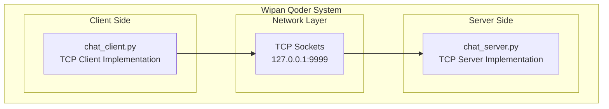
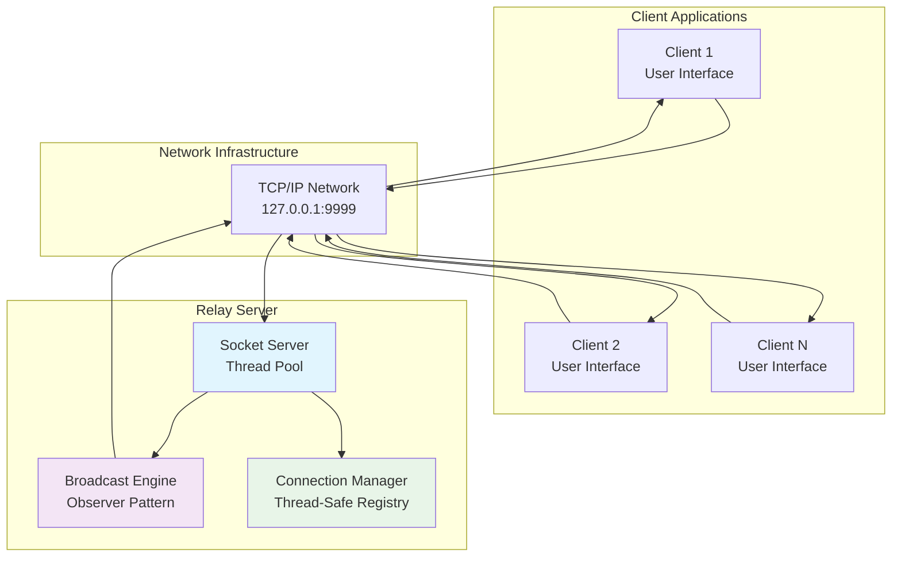
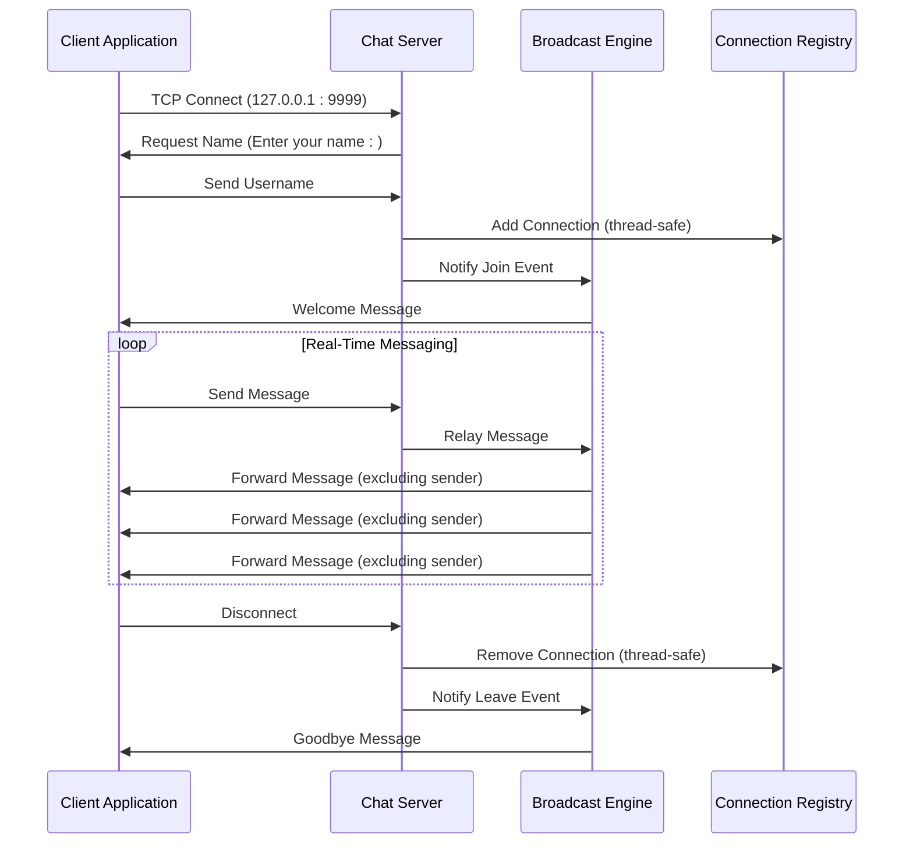
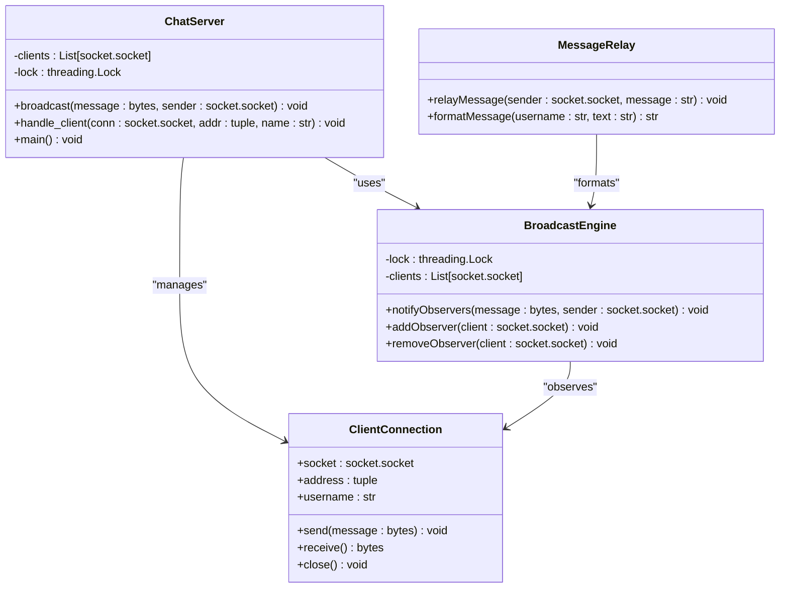
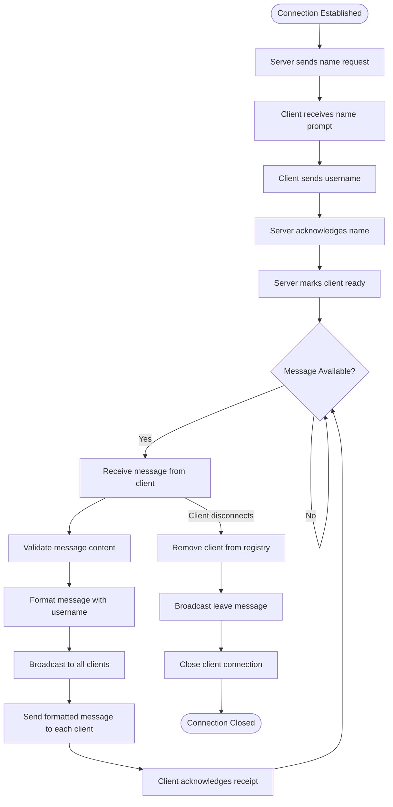
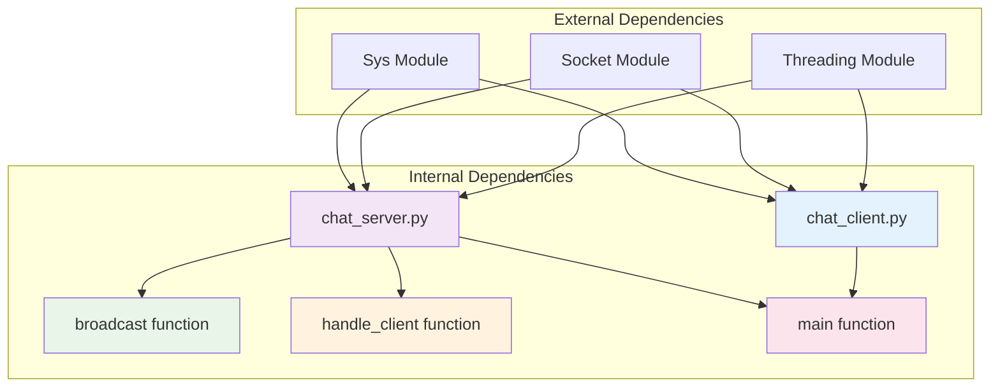
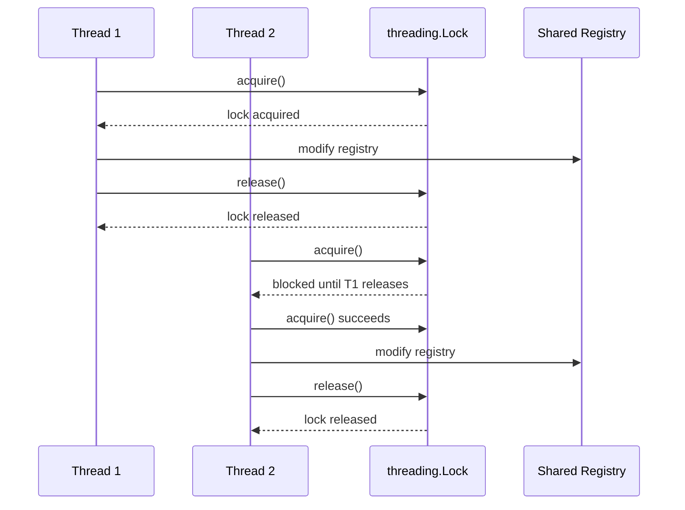

# System Architecture

<cite>
**Referenced Files in This Document**
- [chat_client.py](file://chat_client.py)
- [chat_server.py](file://chat_server.py)
- [README.md](file://README.md)
</cite>

## Table of Contents
1. [Introduction](#introduction)
2. [Project Structure](#project-structure)
3. [Core Components](#core-components)
4. [Architecture Overview](#architecture-overview)
5. [Detailed Component Analysis](#detailed-component-analysis)
6. [Dependency Analysis](#dependency-analysis)
7. [Performance Considerations](#performance-considerations)
8. [Troubleshooting Guide](#troubleshooting-guide)
9. [Conclusion](#conclusion)

## Introduction
The Wipan Qoder system implements a simple TCP socket-based chat application following a client-server architecture pattern. The system demonstrates real-time messaging capabilities through a relay server that broadcasts messages from one client to all other connected clients. This document provides comprehensive architectural analysis covering the observer pattern implementation, threading model, TCP socket communication flow, and thread-safety mechanisms.

## Project Structure
The project consists of two primary components: a client-side application and a server-side relay system.



**Diagram sources**
- [chat_client.py](file://chat_client.py#L1-L54)
- [chat_server.py](file://chat_server.py#L1-L75)

**Section sources**
- [chat_client.py](file://chat_client.py#L1-L54)
- [chat_server.py](file://chat_server.py#L1-L75)
- [README.md](file://README.md#L1-L2)

## Core Components
The system comprises two fundamental components that work together to provide real-time messaging functionality:

### Client Component
The client implementation handles network communication, user input processing, and message display. It establishes TCP connections to the server, manages bidirectional communication, and provides a simple console interface for user interaction.

### Server Component  
The server implementation manages multiple client connections, maintains connection state, and implements the message broadcasting mechanism. It handles client registration, message relaying, and connection lifecycle management.

**Section sources**
- [chat_client.py](file://chat_client.py#L22-L54)
- [chat_server.py](file://chat_server.py#L48-L75)

## Architecture Overview
The Wipan Qoder system follows a classic client-server architecture with a central relay server managing all client communications.



**Diagram sources**
- [chat_server.py](file://chat_server.py#L8-L20)
- [chat_server.py](file://chat_server.py#L22-L46)
- [chat_client.py](file://chat_client.py#L9-L20)

## Detailed Component Analysis

### Client-Server Communication Flow

The communication flow between clients and server follows a well-defined sequence that ensures reliable message delivery and real-time interaction.



**Diagram sources**
- [chat_server.py](file://chat_server.py#L56-L66)
- [chat_server.py](file://chat_server.py#L22-L46)
- [chat_client.py](file://chat_client.py#L26-L35)

### Observer Pattern Implementation for Message Broadcasting

The server implements the observer pattern to manage message distribution to all connected clients. The broadcast mechanism acts as the subject, while each connected client serves as an observer.



**Diagram sources**
- [chat_server.py](file://chat_server.py#L8-L20)
- [chat_server.py](file://chat_server.py#L22-L46)

### Threading Model and Concurrency Management

The system employs a multi-threaded architecture to handle concurrent client connections efficiently. Each client connection spawns a dedicated thread for processing, enabling true parallelism in message handling.

```mermaid
graph TB
subgraph "Server Thread Pool"
ST[Server Thread<br/>Accept Connections]
HT[Handler Threads<br/>Per-Client Processing]
BT[Broadcast Thread<br/>Message Distribution]
end
subgraph "Client Threads"
CT1[Client Thread 1<br/>Receive Messages]
CT2[Client Thread 2<br/>Receive Messages]
CTN[Client Thread N<br/>Receive Messages]
end
subgraph "Shared Resources"
LR[Lock Resource<br/>threading.Lock]
CR[Connection Registry<br/>List[socket]]
end
ST --> HT
HT --> CT1
HT --> CT2
HT --> CTN
HT --> BT
BT --> LR
BT --> CR
style ST fill:#ffecb3
style HT fill:#e1f5fe
style BT fill:#f3e5f5
style LR fill:#ffebee
style CR fill:#e8f5e8
```

**Diagram sources**
- [chat_server.py](file://chat_server.py#L63-L66)
- [chat_server.py](file://chat_server.py#L12-L20)

### TCP Socket Communication Protocol

The system implements a straightforward TCP-based communication protocol with clear message boundaries and connection lifecycle management.



**Diagram sources**
- [chat_server.py](file://chat_server.py#L56-L66)
- [chat_server.py](file://chat_server.py#L22-L46)
- [chat_client.py](file://chat_client.py#L29-L35)

**Section sources**
- [chat_client.py](file://chat_client.py#L9-L20)
- [chat_server.py](file://chat_server.py#L12-L20)
- [chat_server.py](file://chat_server.py#L22-L46)

## Dependency Analysis

The system exhibits minimal coupling between components, with clear separation of concerns between client and server responsibilities.



**Diagram sources**
- [chat_client.py](file://chat_client.py#L1-L4)
- [chat_server.py](file://chat_server.py#L1-L4)

### Thread-Safety Mechanisms and Lock-Based Synchronization

The server implements robust thread-safety mechanisms to protect shared resources during concurrent access scenarios.



**Diagram sources**
- [chat_server.py](file://chat_server.py#L8-L9)
- [chat_server.py](file://chat_server.py#L12-L20)

**Section sources**
- [chat_server.py](file://chat_server.py#L8-L9)
- [chat_server.py](file://chat_server.py#L12-L20)

## Performance Considerations

The system demonstrates several performance characteristics that impact scalability and resource utilization:

### Scalability Factors
- **Connection Limit**: Each client spawns a dedicated thread, limiting concurrent connections based on system resources
- **Memory Usage**: Maintains a list of active client connections in memory
- **Network Throughput**: Single-threaded broadcast operation may become a bottleneck with many clients
- **CPU Utilization**: Each active client consumes CPU cycles for message processing

### Optimization Opportunities
- Implement connection pooling for better resource management
- Consider asynchronous I/O for improved throughput
- Add connection limits and rate limiting
- Implement message queuing for high-volume scenarios

## Troubleshooting Guide

### Common Connection Issues
- **Connection Refused**: Verify server is running and listening on correct IP/port
- **Name Registration Failures**: Ensure client sends non-empty username during handshake
- **Message Delivery Failures**: Check network connectivity and firewall settings

### Thread Safety Issues
- **Race Conditions**: Monitor for concurrent modifications to client registry
- **Deadlocks**: Ensure proper lock acquisition order in all code paths
- **Resource Leaks**: Verify proper cleanup of closed connections

### Debugging Strategies
- Enable verbose logging for connection events
- Monitor thread count and resource usage
- Test with multiple concurrent clients
- Validate graceful shutdown procedures

**Section sources**
- [chat_server.py](file://chat_server.py#L36-L45)
- [chat_client.py](file://chat_client.py#L18-L20)

## Conclusion

The Wipan Qoder system successfully implements a client-server architecture for real-time messaging with clear separation of concerns and robust thread-safety mechanisms. The system demonstrates effective use of the observer pattern for message broadcasting and provides a solid foundation for understanding distributed communication patterns.

Key architectural strengths include:
- Clear client-server separation with well-defined protocols
- Effective observer pattern implementation for scalable message distribution
- Robust thread-safety mechanisms protecting shared resources
- Simple, maintainable code structure suitable for educational purposes

The system serves as an excellent example of fundamental networking concepts and can be extended with additional features such as message persistence, user authentication, and advanced concurrency patterns.