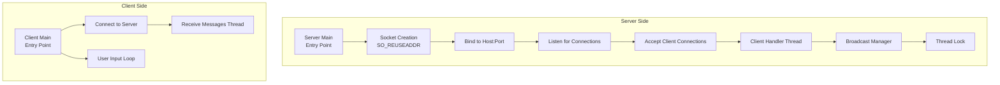
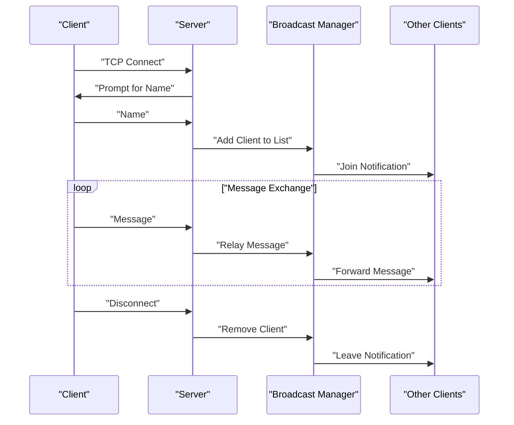
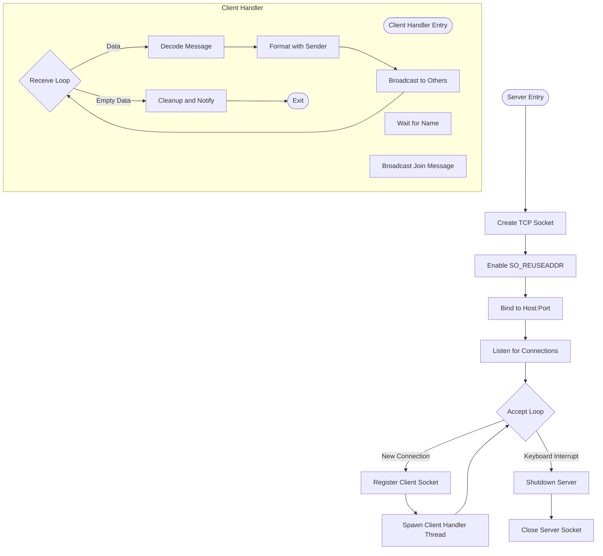
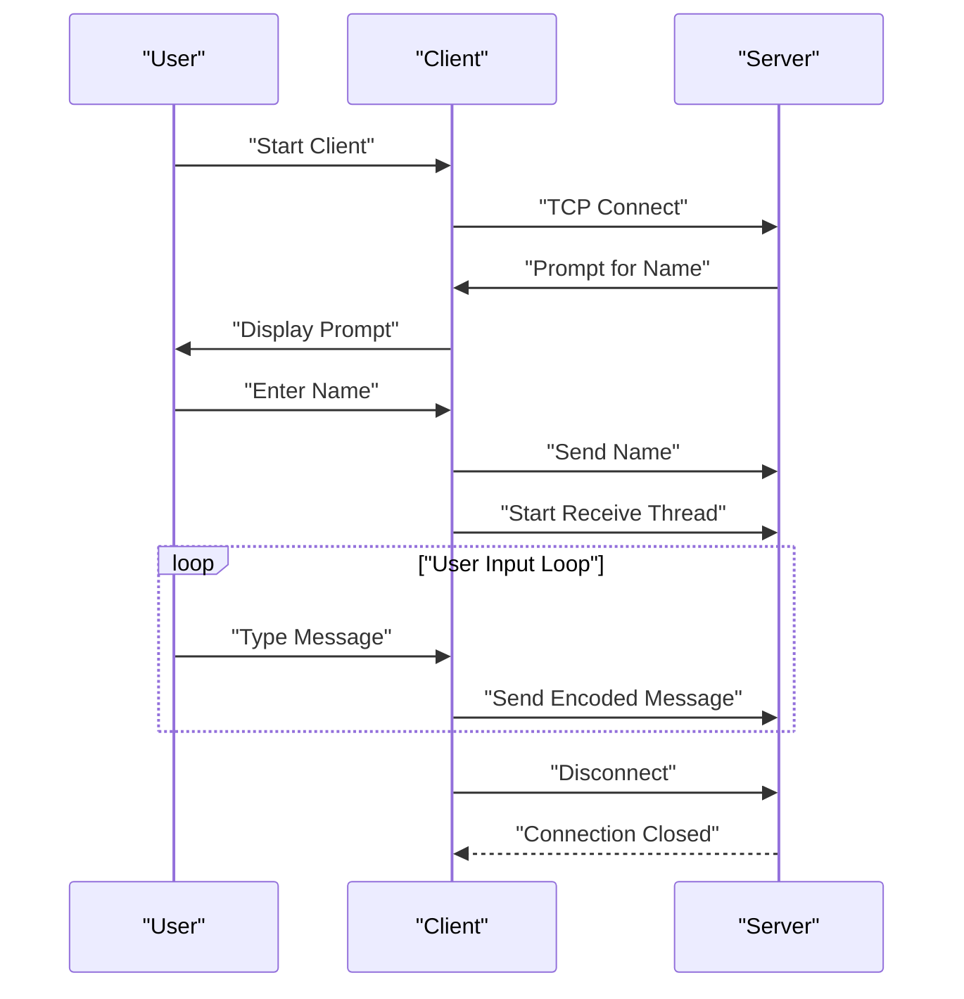
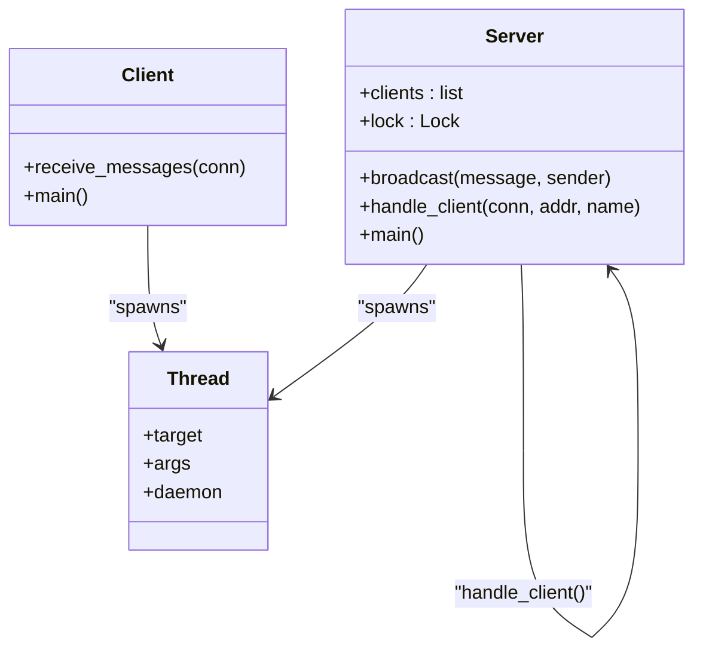
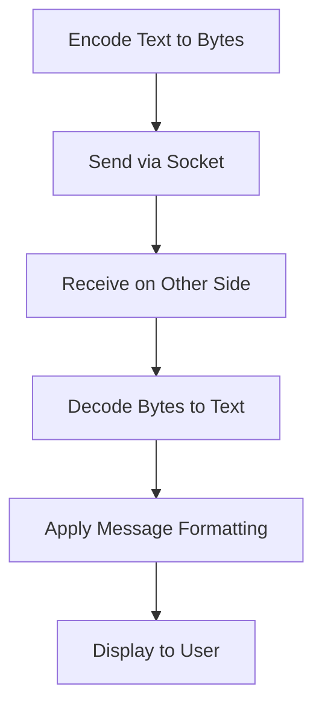
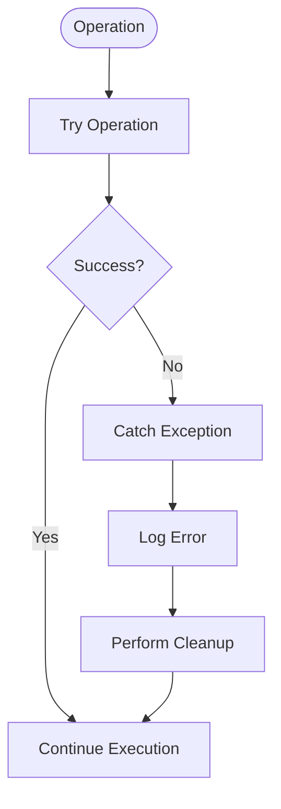
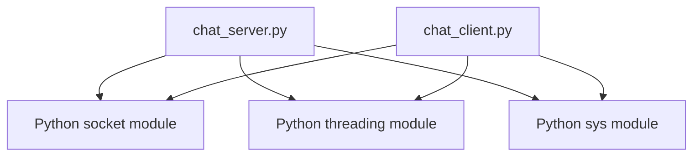

# Technical Implementation Details

<cite>
**Referenced Files in This Document**
- [chat_server.py](file://chat_server.py)
- [chat_client.py](file://chat_client.py)
- [README.md](file://README.md)
</cite>

## Table of Contents
1. [Introduction](#introduction)
2. [Project Structure](#project-structure)
3. [Core Components](#core-components)
4. [Architecture Overview](#architecture-overview)
5. [Detailed Component Analysis](#detailed-component-analysis)
6. [Dependency Analysis](#dependency-analysis)
7. [Performance Considerations](#performance-considerations)
8. [Troubleshooting Guide](#troubleshooting-guide)
9. [Conclusion](#conclusion)

## Introduction
This document provides comprehensive technical documentation for a TCP socket-based chat system. It covers the implementation details of both the server and client components, focusing on socket programming fundamentals, threading and concurrency, message protocols, error handling, synchronization mechanisms, and operational considerations. The system demonstrates a simple yet robust architecture for real-time messaging between multiple clients through a central relay server.

## Project Structure
The project consists of two primary modules:
- chat_server.py: Implements the TCP relay server that manages client connections, broadcasts messages, and handles client lifecycle events.
- chat_client.py: Implements a TCP client that connects to the server, exchanges greetings and messages, and displays incoming messages in real time.

**Diagram sources**
- [chat_server.py](file://chat_server.py#L48-L75)
- [chat_client.py](file://chat_client.py#L22-L54)

**Section sources**
- [chat_server.py](file://chat_server.py#L1-L75)
- [chat_client.py](file://chat_client.py#L1-L54)
- [README.md](file://README.md#L1-L2)

## Core Components
This section outlines the core components and their responsibilities within the chat system.

- Server Socket Management
  - Socket creation with IPv4 and TCP stream semantics.
  - SO_REUSEADDR option to enable immediate reuse of the bound address.
  - Binding to a configurable host and port, with a default fallback.
  - Listening for incoming connections with a backlog parameter.

- Client Connection Lifecycle
  - Accepting client connections in a loop.
  - Requesting and validating client names.
  - Managing a shared client list with thread-safe operations.

- Message Broadcasting
  - Relay mechanism that forwards messages to all connected clients except the sender.
  - Graceful handling of send failures without disrupting other clients.

- Threading Model
  - Dedicated handler threads per client for concurrent message processing.
  - Daemon threads to ensure automatic termination when the main process exits.

- Client-Side Operations
  - Establishing TCP connections to the server.
  - Real-time message reception via a dedicated thread.
  - User input loop for sending messages to the server.

**Section sources**
- [chat_server.py](file://chat_server.py#L48-L75)
- [chat_client.py](file://chat_client.py#L22-L54)

## Architecture Overview
The chat system follows a centralized relay architecture:
- Clients establish TCP connections to the server.
- The server maintains a list of active client sockets.
- Incoming messages from a client are decoded, formatted, and broadcast to all other clients.
- Client-side threads continuously receive and display messages from the server.

**Diagram sources**
- [chat_server.py](file://chat_server.py#L22-L46)
- [chat_client.py](file://chat_client.py#L9-L20)

## Detailed Component Analysis

### Server Implementation Analysis
The server module implements a threaded TCP relay service with the following key elements:

- Socket Creation and Configuration
  - Uses IPv4 and TCP stream sockets.
  - Enables SO_REUSEADDR to prevent bind errors during restarts.
  - Binds to a configurable host and port, defaulting to localhost and a fixed port.

- Connection Acceptance and Client Registration
  - Accepts connections in a continuous loop.
  - Requests a client name upon connection; assigns a default if empty.
  - Registers the client socket in a shared list protected by a lock.

- Client Handler Thread
  - Handles bidirectional message exchange for each client.
  - Decodes received data and formats messages with sender identification.
  - Broadcasts formatted messages to all other clients.

- Broadcasting Mechanism
  - Iterates through the client list under lock protection.
  - Sends encoded messages to each registered client except the sender.
  - Gracefully handles send failures without affecting other clients.

- Cleanup and Resource Management
  - Removes disconnected clients from the shared list.
  - Broadcasts leave notifications to remaining clients.
  - Closes the client socket in the finally block.

**Diagram sources**
- [chat_server.py](file://chat_server.py#L48-L75)
- [chat_server.py](file://chat_server.py#L22-L46)

**Section sources**
- [chat_server.py](file://chat_server.py#L1-L75)

### Client Implementation Analysis
The client module implements a TCP client with concurrent message handling:

- Connection Establishment
  - Creates a TCP socket and connects to the server.
  - Supports configurable host and port via command-line arguments.

- Name Exchange Protocol
  - Receives a greeting prompt from the server.
  - Sends the user-provided name to the server.

- Concurrent Message Handling
  - Dedicated receive thread continuously reads from the server.
  - Main thread handles user input for sending messages.
  - Both threads use daemon flags to ensure clean shutdown.

- Message Reception and Display
  - Reads data in chunks and decodes to text.
  - Writes decoded messages to stdout with flush to ensure immediate display.
  - Handles connection resets gracefully.

**Diagram sources**
- [chat_client.py](file://chat_client.py#L22-L54)
- [chat_client.py](file://chat_client.py#L9-L20)

**Section sources**
- [chat_client.py](file://chat_client.py#L1-L54)

### Threading and Concurrency Model
The system employs a thread-per-client model for handling concurrent connections:

- Server-Side Threading
  - Each accepted client spawns a dedicated handler thread.
  - Handler threads are daemon threads, ensuring automatic termination on main process exit.
  - Shared client list is protected by a threading lock to prevent race conditions.

- Client-Side Threading
  - Receive messages are handled by a separate daemon thread.
  - Main thread remains responsive to user input for sending messages.

- Synchronization Mechanisms
  - Lock acquisition occurs around client list modifications and broadcasts.
  - Atomic operations within the lock protect against concurrent updates.

**Diagram sources**
- [chat_server.py](file://chat_server.py#L8-L9)
- [chat_server.py](file://chat_server.py#L12-L20)
- [chat_server.py](file://chat_server.py#L22-L46)
- [chat_client.py](file://chat_client.py#L9-L20)

**Section sources**
- [chat_server.py](file://chat_server.py#L8-L9)
- [chat_server.py](file://chat_server.py#L12-L20)
- [chat_server.py](file://chat_server.py#L22-L46)
- [chat_client.py](file://chat_client.py#L9-L20)

### Message Protocol and Data Handling
The system implements a simple text-based message protocol:

- Message Encoding and Transmission
  - Messages are encoded to bytes before transmission.
  - Fixed-size receive buffers are used to accommodate incoming data.
  - Messages are terminated with newline characters for readability.

- Delimiter and Formatting
  - Join and leave notifications include server prefixes.
  - Regular messages are formatted with sender identifiers.
  - Output is flushed immediately to ensure real-time display.

- Data Integrity
  - Empty data checks prevent processing of invalid frames.
  - Decoding errors are handled gracefully in both server and client.

**Diagram sources**
- [chat_server.py](file://chat_server.py#L22-L35)
- [chat_client.py](file://chat_client.py#L9-L20)

**Section sources**
- [chat_server.py](file://chat_server.py#L22-L35)
- [chat_client.py](file://chat_client.py#L9-L20)

### Error Handling Strategies
Both server and client implement robust error handling:

- Network Exceptions
  - ConnectionResetError and OSError are caught and handled gracefully.
  - Partial reads and write failures are managed without terminating the entire system.

- Client Disconnections
  - Server removes disconnected clients from the shared list.
  - Broadcasts leave notifications to remaining clients.
  - Client threads terminate upon receiving empty data or connection loss.

- Timeout Considerations
  - No explicit timeouts are configured; operations block until completion.
  - Non-blocking alternatives could be considered for production deployments.

**Diagram sources**
- [chat_server.py](file://chat_server.py#L18-L19)
- [chat_server.py](file://chat_server.py#L36-L37)
- [chat_client.py](file://chat_client.py#L18-L19)

**Section sources**
- [chat_server.py](file://chat_server.py#L18-L19)
- [chat_server.py](file://chat_server.py#L36-L37)
- [chat_client.py](file://chat_client.py#L18-L19)

## Dependency Analysis
The system exhibits minimal external dependencies, relying solely on Python standard library modules:

- Standard Library Dependencies
  - socket: TCP socket creation, binding, listening, and I/O operations.
  - threading: Thread creation and synchronization primitives.
  - sys: Command-line argument parsing and standard output handling.

- Internal Dependencies
  - Server module depends on global client list and lock for coordination.
  - Client module depends on socket connectivity and threading for concurrent operations.

**Diagram sources**
- [chat_server.py](file://chat_server.py#L1-L3)
- [chat_client.py](file://chat_client.py#L1-L3)

**Section sources**
- [chat_server.py](file://chat_server.py#L1-L3)
- [chat_client.py](file://chat_client.py#L1-L3)

## Performance Considerations
Several aspects influence the performance characteristics of the chat system:

- Throughput and Latency
  - Single-threaded broadcasting per message introduces linear complexity O(n) for each broadcast.
  - Large numbers of clients can increase broadcast latency proportionally.

- Memory Management
  - Client sockets remain open until explicit closure or connection reset.
  - String formatting operations create temporary objects; consider reusable buffers for high throughput.

- Resource Cleanup
  - Proper closing of sockets prevents resource leaks.
  - Daemon threads ensure cleanup on main process exit.

- Scalability Limitations
  - Current implementation does not implement connection limits or rate limiting.
  - Consider adding non-blocking I/O or asynchronous frameworks for improved scalability.

[No sources needed since this section provides general guidance]

## Troubleshooting Guide
Common issues and diagnostic approaches:

- Connection Issues
  - Verify server is running and listening on the expected host and port.
  - Check firewall settings and network connectivity between client and server.

- Client Registration Problems
  - Ensure the server prompts for a name and receives input correctly.
  - Confirm that empty names are handled by assigning default identifiers.

- Message Delivery Failures
  - Monitor for send failures during broadcasting; these are logged silently.
  - Verify that client receive threads are active and not blocked.

- Threading Deadlocks
  - Confirm that lock acquisition order is consistent across all operations.
  - Ensure that long-running operations do not hold locks unnecessarily.

- Debugging Techniques
  - Enable verbose logging for connection events and message exchanges.
  - Use network monitoring tools to inspect TCP traffic between client and server.

**Section sources**
- [chat_server.py](file://chat_server.py#L12-L20)
- [chat_server.py](file://chat_server.py#L22-L46)
- [chat_client.py](file://chat_client.py#L9-L20)

## Conclusion
The chat system demonstrates a clean and functional implementation of TCP socket programming with threading-based concurrency. It effectively manages multiple client connections, implements a straightforward message protocol, and provides graceful error handling and resource cleanup. While suitable for educational and small-scale deployments, production environments may benefit from enhancements such as connection limits, non-blocking I/O, explicit timeouts, and more sophisticated error reporting.