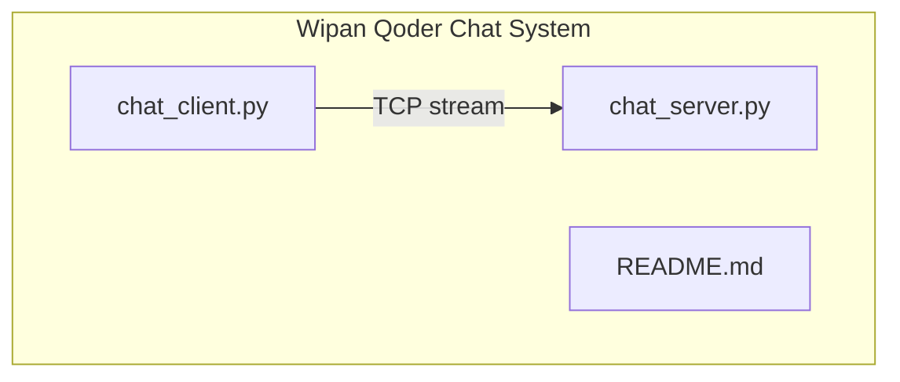
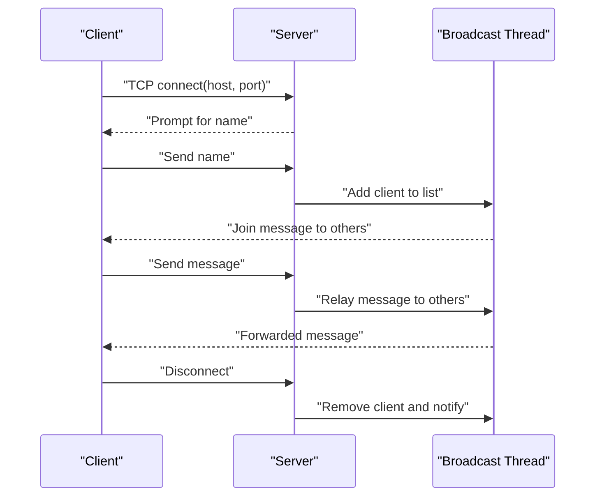
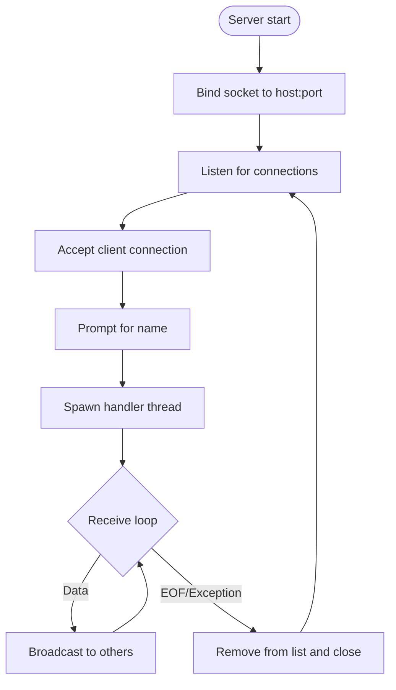
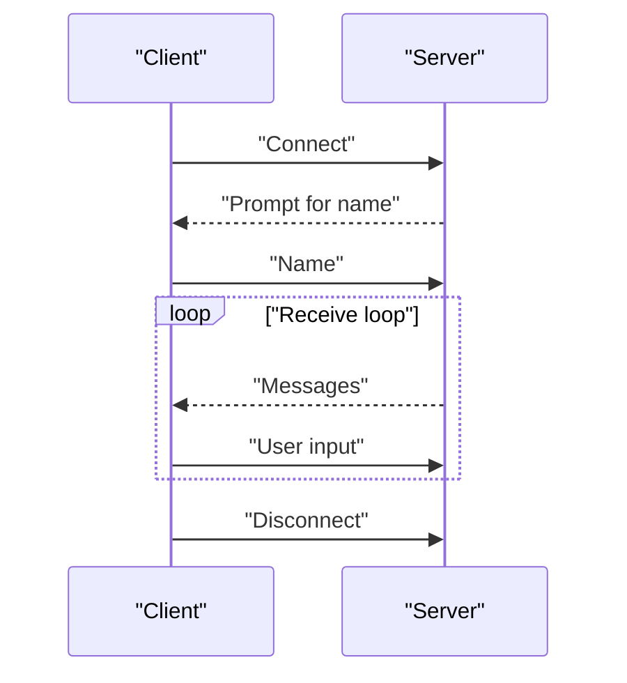

# Troubleshooting and FAQ

<cite>
**Referenced Files in This Document**
- [chat_server.py](file://chat_server.py)
- [chat_client.py](file://chat_client.py)
- [README.md](file://README.md)
</cite>

## Table of Contents
1. [Introduction](#introduction)
2. [Project Structure](#project-structure)
3. [Core Components](#core-components)
4. [Architecture Overview](#architecture-overview)
5. [Detailed Component Analysis](#detailed-component-analysis)
6. [Dependency Analysis](#dependency-analysis)
7. [Performance Considerations](#performance-considerations)
8. [Troubleshooting Guide](#troubleshooting-guide)
9. [Conclusion](#conclusion)

## Introduction
This document provides comprehensive troubleshooting guidance for the Wipan Qoder chat system. It focuses on diagnosing and resolving common connection issues, error scenarios, and performance-related problems. The system consists of a TCP-based chat server and a client that communicates over a local loopback interface by default. The goal is to help users quickly identify causes of failures such as port conflicts, firewall restrictions, socket binding errors, connection timeouts, and client disconnections, and to offer actionable solutions.

## Project Structure
The repository contains two primary Python scripts and a minimal README:
- chat_server.py: Implements a TCP relay server that accepts connections, manages client threads, and broadcasts messages to connected peers.
- chat_client.py: Implements a TCP client that connects to the server, exchanges a name, and relays messages bidirectionally.
- README.md: Brief description of the chat system’s purpose.

**Diagram sources**
- [chat_server.py](file://chat_server.py#L48-L75)
- [chat_client.py](file://chat_client.py#L22-L54)

**Section sources**
- [README.md](file://README.md#L1-L2)

## Core Components
- Server
  - Host and port defaults to loopback address and a fixed port.
  - Uses a socket with reuse-address option to reduce bind-time conflicts.
  - Accepts incoming connections and spawns a dedicated thread per client.
  - Broadcasts messages to all connected clients except the sender.
- Client
  - Connects to the configured host and port.
  - Receives a name prompt from the server and sends the user’s chosen name.
  - Runs a background thread to continuously receive messages and prints them to stdout.
  - Sends user input to the server as chat messages.

Key runtime behaviors:
- Default host is loopback; default port is fixed.
- Client threads are daemon threads; server exits cleanly on keyboard interrupt.
- Broadcasting uses a lock to protect shared client list.

**Section sources**
- [chat_server.py](file://chat_server.py#L1-L75)
- [chat_client.py](file://chat_client.py#L1-L54)

## Architecture Overview
The system follows a simple client-server model over TCP:
- Clients connect to the server using IPv4 TCP sockets.
- The server maintains a list of active connections and a lock for thread-safe broadcasting.
- Messages are forwarded to all other clients asynchronously.

**Diagram sources**
- [chat_server.py](file://chat_server.py#L22-L46)
- [chat_client.py](file://chat_client.py#L9-L20)

## Detailed Component Analysis

### Server Behavior and Threading Model
- Socket creation and binding
  - Creates a TCP socket and sets reuse-address to minimize bind-time conflicts.
  - Binds to the configured host and port and listens for up to a small backlog.
- Client lifecycle
  - Accepts connections and requests a name from the client.
  - Starts a daemon thread to handle the client session.
  - On exit, removes the client from the shared list and notifies others.
- Broadcasting
  - Iterates over the client list under a lock and sends messages to all except the sender.
  - Ignores send errors to avoid server shutdown on peer issues.

**Diagram sources**
- [chat_server.py](file://chat_server.py#L48-L75)
- [chat_server.py](file://chat_server.py#L12-L46)

**Section sources**
- [chat_server.py](file://chat_server.py#L48-L75)

### Client Behavior and Message Flow
- Connection establishment
  - Connects to the configured host and port.
  - Receives a prompt for the user’s name and sends it to the server.
- Receive loop
  - Runs a background thread to continuously read messages and print them.
  - Handles connection reset and OS-level errors gracefully.
- Send loop
  - Reads user input and sends it to the server until interrupted.

**Diagram sources**
- [chat_client.py](file://chat_client.py#L22-L54)
- [chat_client.py](file://chat_client.py#L9-L20)

**Section sources**
- [chat_client.py](file://chat_client.py#L22-L54)

## Dependency Analysis
- Runtime dependencies
  - Both scripts rely on the standard library networking and threading modules.
  - No external third-party libraries are used.
- Coupling
  - The client and server are coupled by protocol expectations: the server prompts for a name and the client responds immediately after connecting.
  - The server uses a global list and a lock to coordinate broadcasting, increasing cohesion within the server module.

Potential risks:
- Global mutable state (client list) and a single lock introduce contention under high concurrency.
- Daemon threads mean abrupt termination may not flush buffered output reliably.

**Section sources**
- [chat_server.py](file://chat_server.py#L8-L9)
- [chat_server.py](file://chat_server.py#L12-L19)
- [chat_client.py](file://chat_client.py#L1-L3)

## Performance Considerations
- Memory usage
  - Each connected client holds a socket and buffers in the receive loop; memory grows linearly with concurrent connections.
  - The server stores all active connections in memory; long-running servers may accumulate many descriptors.
- Thread management
  - Each client spawns a daemon thread. Daemon threads do not prevent process exit, but they can terminate mid-send, potentially dropping messages.
  - Lock-protected broadcast reduces contention but still serializes send operations across all peers.
- Connection limits
  - The server’s listen backlog is small; high connection spikes may be rejected.
  - The default port is fixed; running multiple servers requires changing the port per instance.
- Throughput and latency
  - Broadcasting to all peers scales poorly with N; consider optimizing broadcast or rate-limiting.
  - Large messages are handled via a fixed buffer; very large inputs may require chunking or protocol framing.

[No sources needed since this section provides general guidance]

## Troubleshooting Guide

### 1) Port Conflicts and Binding Failures
Symptoms:
- Server fails to start with an error indicating the port is already in use or cannot be bound.

Common causes:
- Another instance of the server is already running on the same host and port.
- A previous run did not shut down cleanly, leaving the port in TIME_WAIT or bound state.

Diagnostics:
- Verify the port is free using system tools (e.g., netstat, ss, lsof).
- Confirm the server binds to the intended host and port by checking startup logs.

Resolutions:
- Stop the conflicting process or change the port argument when starting the server.
- Use SO_REUSEADDR to mitigate immediate reuse issues (already enabled).
- Restart the machine if necessary to release stubborn locks.

**Section sources**
- [chat_server.py](file://chat_server.py#L48-L54)

### 2) Connection Refused Errors
Symptoms:
- Client reports “connection refused” when attempting to connect to the server.

Common causes:
- Server is not running or not listening on the expected host/port.
- Incorrect host or port passed to the client.
- Firewall or OS policy blocking outbound/inbound connections.

Diagnostics:
- Confirm the server is started and listening on the correct host and port.
- Validate client arguments for host and port.
- Test connectivity locally using a command-line tool (e.g., telnet or nc) to the configured host and port.

Resolutions:
- Start the server before the client.
- Correct host/port arguments to match server configuration.
- Temporarily disable firewall or add an exception for the port.

**Section sources**
- [chat_client.py](file://chat_client.py#L22-L27)
- [chat_server.py](file://chat_server.py#L48-L54)

### 3) Timeout Exceptions and Network Connectivity Issues
Symptoms:
- Client receives a timeout during connect or recv operations.
- Messages appear delayed or intermittent.

Common causes:
- Network misconfiguration or routing issues.
- Excessive load causing slow response.
- Misconfigured proxy or DNS resolution delays.

Diagnostics:
- Use ping and traceroute to assess network health.
- Measure latency to the target host.
- Monitor server resource usage (CPU, memory) under load.

Resolutions:
- Fix routing or DNS issues.
- Reduce concurrent connections or increase server capacity.
- Adjust client-side timeouts if applicable.

**Section sources**
- [chat_client.py](file://chat_client.py#L26-L27)
- [chat_server.py](file://chat_server.py#L28-L35)

### 4) Client Disconnection Issues
Symptoms:
- Client unexpectedly disconnects or receives a “disconnected” message.
- Server logs show a client leaving unexpectedly.

Common causes:
- Peer resets the connection (e.g., abrupt client termination).
- OS-level network errors or interrupts.
- Server-side exceptions during broadcast or send.

Diagnostics:
- Check client logs for connection reset or OS errors.
- Review server logs for exceptions caught during receive loops.
- Inspect whether the client was terminated abruptly.

Resolutions:
- Ensure clients exit gracefully (Ctrl+C is supported).
- Improve error handling to log more context on exceptions.
- Add retry logic or reconnection in the client if desired.

**Section sources**
- [chat_client.py](file://chat_client.py#L18-L19)
- [chat_server.py](file://chat_server.py#L36-L37)

### 5) Socket Programming and Protocol Problems
Common issues:
- Partial reads or writes leading to message fragmentation.
- Deadlocks or race conditions due to shared state.

Diagnostics:
- Add logging around send/receive operations to track partial transfers.
- Verify that the server and client agree on the handshake (name prompt and response).

Resolutions:
- Implement explicit framing or length-prefixed messages to avoid partial reads.
- Ensure consistent ordering of operations and avoid holding locks during I/O.

**Section sources**
- [chat_client.py](file://chat_client.py#L9-L19)
- [chat_server.py](file://chat_server.py#L12-L19)

### 6) Incorrect Host/Port Configuration
Symptoms:
- Client cannot connect or connects to the wrong endpoint.

Common causes:
- Wrong host or port passed to the client.
- Server configured to listen on a non-loopback interface without proper exposure.

Diagnostics:
- Compare client arguments with server startup logs.
- Verify the server’s bind address and port.

Resolutions:
- Pass correct host and port to the client.
- If exposing the server beyond localhost, configure the host accordingly and open the port in firewall.

**Section sources**
- [chat_client.py](file://chat_client.py#L22-L24)
- [chat_server.py](file://chat_server.py#L48-L54)

### 7) Name Assignment Conflicts
Symptoms:
- Unexpected behavior when multiple clients use the same name.
- Broadcast messages become ambiguous.

Common causes:
- Clients sending identical names.

Diagnostics:
- Observe broadcast messages to confirm duplicate names.
- Consider adding server-side validation or auto-generated names.

Resolutions:
- Enforce unique names server-side or append identifiers.
- Improve client UX to warn on duplicates.

**Section sources**
- [chat_server.py](file://chat_server.py#L22-L25)

### 8) Platform Differences and System-Specific Considerations
- Loopback vs. external interfaces
  - Default host is loopback; to accept external connections, adjust the server host setting and ensure the port is exposed.
- Daemon threads
  - Daemon threads can terminate mid-operation; ensure graceful shutdown and avoid relying on daemon threads for critical cleanup.
- Resource limits
  - Operating systems impose limits on file descriptors and threads; monitor ulimit and adjust as needed under heavy load.

**Section sources**
- [chat_server.py](file://chat_server.py#L5-L6)
- [chat_server.py](file://chat_server.py#L65-L66)

### 9) Debugging Techniques
- Enable verbose logging
  - Add timestamps and context to server logs for easier correlation.
- Network capture
  - Use tcpdump or Wireshark to inspect packets and confirm handshake and message exchange.
- Stress testing
  - Simulate multiple clients to uncover race conditions and resource exhaustion.
- Isolation
  - Run server and client on the same machine to eliminate network variability.

[No sources needed since this section provides general guidance]

## Conclusion
This guide outlined the most frequent issues in the Wipan Qoder chat system and provided targeted diagnostics and remedies. By validating host/port configuration, addressing port conflicts, improving error handling, and tuning performance characteristics, most problems can be resolved quickly. For production deployments, consider enhancing protocol framing, enforcing unique names, and adding robustness against abrupt disconnections.